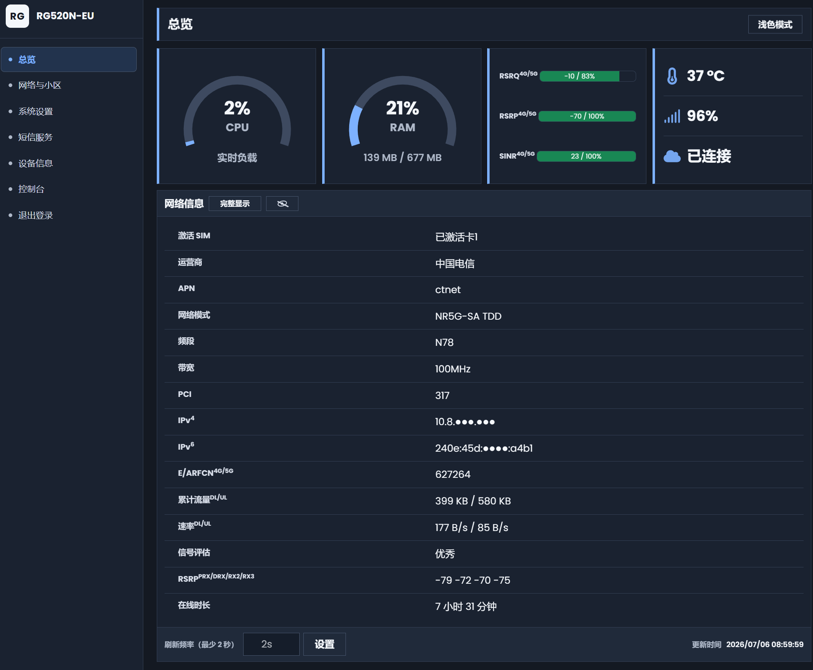
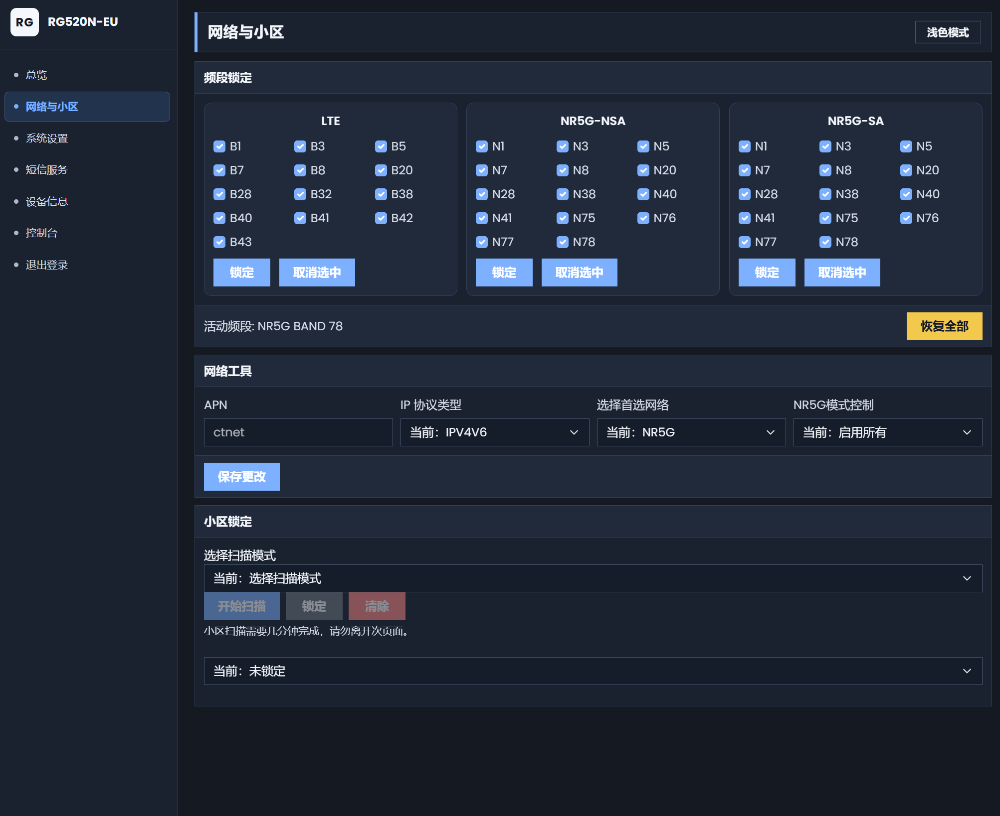
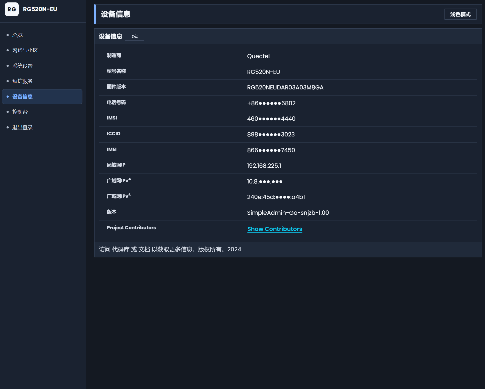
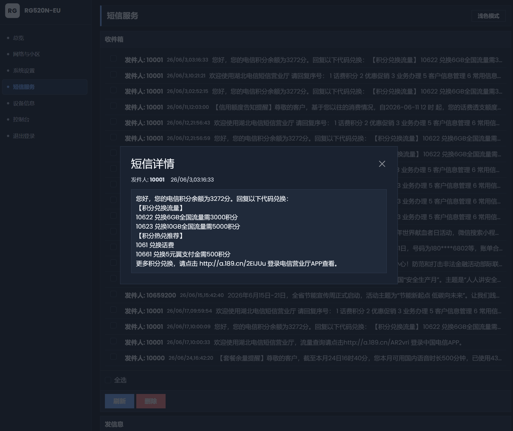

# SimpleAdmin Go 项目说明

SimpleAdmin Go 是一个面向模块设备的本地管理 Web 项目。项目由 Go 后端、Vue 3 前端、安装/卸载脚本、Windows 本地测试工具和模块端服务启动逻辑组成。后端负责静态页面托管、认证、AT 通道、短信、TTL、控制台和基础状态接口；前端负责设备信息、网络设置、短信、系统设置等页面交互。

M28无系统权限的模块也可以刷入后自动启动。


安装此版本请务必卸载之前任何版本的webui，否则无法正常运行。

安装此版本请务必卸载之前任何版本的webui，否则无法正常运行。

安装此版本请务必卸载之前任何版本的webui，否则无法正常运行。

重要的事说三遍

如无法卸载可以发送恢复出厂指令AT+QCFG="ResetFactory"指令后，在刷固件后即可，发送恢复出厂后需要重新设置开启网口和开启adb。

开启ETH网口指令： AT+QCFG="data_interface",0,0;+QCFG="pcie/mode",1;+QETH="eth_driver","r8125",1;+QCFG="usbnet",1;+QMAPWAC=1

关闭ETH网口指令： AT+QCFG="data_interface",0,0;+QCFG="pcie/mode",0;+QETH="eth_driver","r8125",0;+QCFG="usbnet",0;+QMAPWAC=0

开ADB步骤
1，查询ADBKEY指令： AT+QADBKEY?

2，计算ADB密码： https://onecompiler.com/python/3znepjcsq

3，查询当前配置：AT+QCFG="usbcfg"
返回的结果是+QCFG: "usbcfg",0xXXXX,0xXXXX,1,1,1,1,1,0,0
改倒数第二位的0改成1

4，发送AT+QCFG="usbcfg",0xXXXX,0xXXXX,1,1,1,1,1,1,0（注意0xXXXX,0xXXXX要改成查询到的值）

5，重启指令： AT+CFUN=1,1

正常开启ADB后，运行toolkit.bat即可安装，是完全离线安装。

后台默认地址192.168.225.1，账号密码都是admin，控制台账号root 密码admin321

网页登录密码在“系统设置”顶部的“账户安全”区域修改，需填写当前密码、新密码和确认密码。保存成功后自动返回登录页，所有旧登录会话及其业务、控制台连接均失效；控制台的独立账号密码不随网页登录密码修改。

安装成功后如果打不开后台就清理一下浏览器缓存，注意是http不带s

安装成功后如果打不开后台就清理一下浏览器缓存，注意是http不带s

安装成功后如果打不开后台就清理一下浏览器缓存，注意是http不带s

重要的事说三遍







## 目录结构

```text
Simple_Admin_GO/
├── toolkit.bat
├── uninstall.bat
├── run_windows_test.bat
├── adb.exe
├── AdbWinApi.dll
├── AdbWinUsbApi.dll
├── development/
│   ├── install_simpleadmin_go.sh
│   ├── uninstall_simpleadmin_go.sh
│   └── simpleadmin/
│       ├── simpleadmin-httpd.armv7
│       ├── simplepasswd
│       ├── mobileap_bridge0_mac.sh
│       ├── systemd/simpleadmin-httpd.service
│       └── www/
├── go-build/
│   ├── build_simpleadmin_go.bat
│   └── simpleadmin-go/
├── windows-test/
│   ├── build_windows_test.bat
│   ├── run_windows_test.bat
│   ├── bin/simpleadmin-httpd-windows-amd64.exe
│   └── data/
└── README.md
```

## 根目录文件说明

| 文件 | 作用 |
|---|---|
| `toolkit.bat` | Windows 一键安装入口。等待 ADB 设备，推送 `development/` 到模块，并调用模块端安装脚本。 |
| `uninstall.bat` | Windows 一键卸载入口。通过 ADB 调用模块端卸载脚本。 |
| `run_windows_test.bat` | Windows 本地测试入口，启动 `windows-test` 中的测试服务；批处理窗口输出中文提示，使用 GBK/CP936 编码和 CRLF 换行，避免 Windows cmd 误解析中文行。 |
| `adb.exe` | Windows ADB 可执行文件。 |
| `AdbWinApi.dll` / `AdbWinUsbApi.dll` | Windows ADB 运行所需动态库。 |
| `README.md` | 项目说明、目录说明、函数说明、开发约束。 |

## 模块端安装目录 `development/`

### `development/install_simpleadmin_go.sh`

模块端安装脚本，负责把 Go 后端、Web 文件、认证文件、TTL 状态文件和独立的 mobileap/bridge0 固定 MAC 脚本安装到 `/usrdata`；重复安装时会先停止旧的 systemd 服务、旧的 `/usrdata` 后台进程，并清理旧版 `/dev/ttyIN`、`/dev/ttyOUT`、`socat` 桥接残留；随后覆盖当前版本文件，避免未卸载直接安装时旧进程继续占用 AT 口；优先把 systemd 服务文件写入 `/lib/systemd/system` 并启动服务，systemd 服务 active 时不修改 `/etc/init.post_boot.sh`；如果 `/lib/systemd/system` 不可写或服务无法 active，才自动改用 `/usrdata/simpleadmin/start_simpleadmin.sh` 后台启动方式，并在 `/etc/init.post_boot.sh` 可写时写入带标记的 post_boot 自启块；启动 SimpleAdmin 前会先执行 `/usrdata/simpleadmin/prepare_simpleadmin_ports.sh`，停止旧 `simpleadmin-httpd` 和设备原厂 `/usr/sbin/lighttpd -f /data/lighttpd.conf` 运行进程以释放 80 端口；如果 80 端口仍被其他进程占用，会在 bat 窗口用中文提示并输出占用进程信息，同时把安装结果写为失败，外层 bat 会停止成功提示；脚本通过 Windows bat 安装/卸载窗口可见的日志和提示使用 UTF-8 中文输出，由 bat 启动时统一设置的 UTF-8 代码页显示；写入配置文件、结果 env 文件、生成的后台启动脚本和 post_boot 运行日志等非 bat 窗口直接显示内容仍保持英文。

| 函数 | 功能 |
|---|---|
| `log()` | 输出普通安装日志。 |
| `warn()` | 输出警告日志。 |
| `fail()` | 输出错误、把本次安装结果写为失败并终止脚本。 |
| `write_install_failure_result()` / `write_install_success_result()` | 写入 `/tmp/simpleadmin-install-result.env` 中的 `INSTALL_STATUS`，供 Windows bat 判断远端安装是否真正成功。 |
| `remount_rw()` | 尝试把根文件系统重新挂载为可写。 |
| `remount_ro()` | 尝试把根文件系统重新挂载为只读。 |
| `require_file()` | 检查安装包中的必需文件是否存在。 |
| `is_writable_dir()` / `find_systemd_dir()` | 检测 `/lib/systemd/system` 是否可写；可写时才走 systemd，不可写时走 `/usrdata` 后台启动和 post_boot 兜底。 |
| `link_unit()` | 在可写的 `multi-user.target.wants` 中创建 systemd 服务软链接。 |
| `install_at_device_config()` | 写入 `/usrdata/simpleadmin/at_devices.conf`，只保留 Go AT 设备 `/dev/smd11`。 |
| `cleanup_legacy_at_bridges()` | 只清理旧版 `/dev/ttyIN`、`/dev/ttyOUT`、`socat` 桥接残留，不清理系统 `port_bridge`，也不触碰 `/dev/smd7`。 |
| `stop_existing_simpleadmin_runtime()` | 重复安装前停止旧 systemd 服务、旧后台 PID、旧 `simpleadmin-httpd` 进程，清理旧版 AT 桥接残留，然后删除旧 systemd unit；安装前不清理 post_boot，避免在 systemd 路径安装时改动 `/etc/init.post_boot.sh`。 |
| `install_ttl_state()` | 初始化 `/usrdata/simpleadmin/ttlvalue`，仅复用 Go 版本自身的 TTL 状态；安装时不读取或清理旧版 SimpleAdmin TTL 残留。 |
| `install_mobileap_helper_script()` | 把独立的 `mobileap_bridge0_mac.sh` 安装到 `/usrdata/simpleadmin/mobileap_bridge0_mac.sh`。 |
| `maybe_install_bridge0_mac_config()` | 调用独立的 mobileap/bridge0 固定 MAC 脚本，读取 `/tmp/simpleadmin-mobileap-result.env`，并把是否实际修改 `mobileap_cfg.xml` 的结果传给安装流程。 |
| `write_reboot_marker_if_mobileap_cfg_touched()` | 只有独立脚本返回实际恢复或修改了 `mobileap_cfg.xml` 时，才写出本次安装结果 `/tmp/simpleadmin-install-result.env` 为 `REBOOT_REQUIRED=1`，并兼容写出 `/tmp/simpleadmin-reboot-required` 标记；如果配置中的目标字段已经和 `bridge0_mac` 一致，则写 `REBOOT_REQUIRED=0`，不写重启标记；Windows 安装工具只相信本次安装结果文件，不再因为旧标记文件残留而误触发重启。目标字段选择顺序为：先检查 `APMACAddress`，存在则只写它；不存在时才检查 `EarlyEthMode` 和 `EarlyEthMACAddr`，两者都存在才写入 `EarlyEthMode=1` 和目标 `EarlyEthMACAddr`；都不存在则不写并提示。安装脚本自身不直接 reboot，由 `toolkit.bat` 在显示安装成功后按需直接重启。 |
| `install_simpleadmin_files()` | 安装 `simpleadmin-httpd`、Web 静态文件、认证文件、`/usrdata` 后台启动/停止脚本，并在可写时安装 systemd 服务文件。 |
| `install_fallback_scripts()` | 在 `/usrdata/simpleadmin` 下生成 `prepare_simpleadmin_ports.sh`、`start_simpleadmin.sh` 和 `stop_simpleadmin.sh`；`prepare_simpleadmin_ports.sh` 用于 systemd 和 fallback 启动前释放 80 端口，只停止旧 SimpleAdmin 进程和设备原厂 `/usr/sbin/lighttpd -f /data/lighttpd.conf` 运行进程，不删除 lighttpd 配置文件；`start_simpleadmin.sh` / `stop_simpleadmin.sh` 用于只读根分区环境的后台启动和停止；启动前只清理旧版 AT 桥接残留，不处理系统 `port_bridge`。 |
| `install_post_boot_autostart()` / `remove_post_boot_autostart()` | 仅在 systemd 不可用或服务无法 active 并进入 fallback 安装时，才在 `/etc/init.post_boot.sh` 中写入或更新带标记的 SimpleAdmin 自启块；systemd active 路径不修改 post_boot。 |
| `install_systemd_unit()` | 尝试把服务文件安装到 `/lib/systemd/system`，并清理旧的 `/etc/systemd/system` 同名 unit，成功后设置 systemd 启动标记；失败时不终止安装。 |
| `start_fallback_service()` | 当 systemd 不可用或服务启动失败时，用 `nohup` 启动 `/usrdata/simpleadmin/simpleadmin-httpd`，参数使用当前二进制支持的 `-static`、`-auth-file` 和 `-at-devices-file`；启动前调用端口准备脚本释放 80 端口，端口仍被其他进程占用时输出占用进程信息并明确提示；默认不启用 `-at-debug` 串口调试日志。 |
| `restart_services()` | 优先通过 `/lib/systemd/system` 下的 systemd unit 启动；systemd active 时不修改 post_boot；`/lib/systemd/system` 不可写或服务不 active 时才写入 post_boot 并退回 `/usrdata` 后台启动方式。 |
| `main()` | 安装流程入口，按顺序执行挂载、旧运行实例清理、文件安装、配置写入、服务启动。 |

### `development/uninstall_simpleadmin_go.sh`

模块端卸载脚本，只删除 SimpleAdmin Go 版本自身安装的 systemd 服务、`/usrdata` 后台启动进程、Web 文件、认证辅助文件和配置文件；脚本通过 Windows bat 卸载窗口可见的日志和提示使用 UTF-8 中文输出，由 bat 启动时统一设置的 UTF-8 代码页显示；脚本内部变量、systemd 操作、删除逻辑和非 bat 窗口直接显示内容仍保持英文。

| 函数 | 功能 |
|---|---|
| `log()` | 输出卸载日志。 |
| `warn()` | 输出卸载警告。 |
| `remount_rw()` | 尝试把根文件系统重新挂载为可写。 |
| `remount_ro()` | 尝试把根文件系统重新挂载为只读。 |
| `stop_service()` | 停止指定 systemd 服务。 |
| `stop_fallback_process()` | 停止 `/usrdata` 后台启动的 `simpleadmin-httpd` 进程并删除 PID 文件，同时只清理旧版 AT 桥接残留，不处理系统 `port_bridge`。 |
| `remove_post_boot_autostart()` | 卸载时从 `/etc/init.post_boot.sh` 中删除 SimpleAdmin 自启块。 |
| `remove_unit()` | 停止、禁用并从 `/etc/systemd/system`、`/lib/systemd/system` 中尽量删除指定 systemd 服务文件和 wants 软链接；路径只读时忽略错误。 |
| `clear_go_ttl_rules()` | 清除 Go 管理的 TTL iptables 规则。 |
| `remove_simpleadmin_go_files()` | 删除 SimpleAdmin Go 服务、Go 版本 Web 目录、`simpleadmin-httpd`、认证文件、历史证书文件、AT 设备配置、TTL 状态和 bridge0 MAC 记录；同时清理旧版可能遗留的 `socat-armel-static` 文件。 |
| `reload_systemd()` | 重新加载 systemd 并 reset failed 状态。 |
| `main()` | 卸载流程入口。 |

### `development/simpleadmin/simpleadmin-httpd.armv7`

模块端运行的 Linux ARMv7 Go 后端二进制。由 `go-build/simpleadmin-go` 交叉编译生成，项目约束要求使用 Go 1.26.3 编译；在模块上优先由 systemd 启动，只读 squashfs 根分区环境下由 `/usrdata/simpleadmin/start_simpleadmin.sh` 后台启动。

### `development/simpleadmin/simplepasswd`

认证辅助程序，用于更新或生成页面登录使用的账号密码文件。


### 安装/卸载清理边界

安装脚本会覆盖 SimpleAdmin Go 当前版本需要的运行文件和配置；重复安装前会停止旧 `simpleadmin-httpd`、删除旧 SimpleAdmin systemd unit，并只清理旧版 `/dev/ttyIN`、`/dev/ttyOUT`、`socat` 桥接残留；安装前不清理 post_boot，systemd active 路径也不修改 post_boot，只有 fallback 自启安装时才写入或更新 SimpleAdmin 自己的 post_boot 标记块。启动 SimpleAdmin 前会停止设备原厂 `/usr/sbin/lighttpd -f /data/lighttpd.conf` 运行进程以释放 80 端口，但不删除或修改 `/data/lighttpd.conf`、`/WEBSERVER/www/`、CGI、simpleupdates、旧 TTL 脚本或 `/usrdata/simplefirewall` 等历史文件目录，也不会清理系统 `port_bridge`。卸载脚本只卸载 SimpleAdmin Go 自身内容。

### 安装过程会操作的文件和入口

重复安装时的顺序为：先尝试 remount 根分区为可写；停止并禁用旧 `simpleadmin-httpd.service`；执行旧的 `/usrdata/simpleadmin/stop_simpleadmin.sh`；删除旧 PID；`killall simpleadmin-httpd`；清理旧版 `/dev/ttyIN`、`/dev/ttyOUT`、`socat` 桥接残留；删除 SimpleAdmin 自己写入的 systemd unit；备份有效的登录认证文件；然后再覆盖当前版本文件。覆盖后会恢复有效认证文件；如果认证文件不存在、为空或格式无效，则重置为 `admin:admin` 并设置 `0600` 权限。该流程不清理 post_boot。

安装过程会创建或覆盖：

- `/usrdata/simpleadmin/simpleadmin-httpd`
- `/usrdata/simpleadmin/www/`
- `/usrdata/simpleadmin/systemd/simpleadmin-httpd.service`
- `/usrdata/simpleadmin/prepare_simpleadmin_ports.sh`
- `/usrdata/simpleadmin/start_simpleadmin.sh`
- `/usrdata/simpleadmin/stop_simpleadmin.sh`
- `/usrdata/simpleadmin/mobileap_bridge0_mac.sh`
- `/usrdata/simpleadmin/at_devices.conf`（默认只写入 `/dev/smd11`）
- `/usrdata/simpleadmin/ttlvalue`
- `/usrdata/root/bin/simplepasswd`
- `/usrdata/simpleadmin/simpleadmin.auth`，不存在、空文件或格式无效时重置为 `admin:admin`；已存在且格式有效时会备份到 `/tmp/simpleadmin.auth.backup` 后恢复，保留用户已改过的有效密码。

安装过程可能创建或更新：

- `/lib/systemd/system/simpleadmin-httpd.service` 和 `/lib/systemd/system/multi-user.target.wants/simpleadmin-httpd.service`，仅当 `/lib/systemd/system` 可写且 systemd 路径可用时。
- `/etc/init.post_boot.sh` 中的 SimpleAdmin 标记块，仅当 systemd 不可用或服务无法 active 时。
- 默认安装会启用 bridge0 MAC 固定流程，优先使用 `/usrdata/etc/data/mobileap_cfg.xml`，不存在时兜底 `/etc/data/mobileap_cfg.xml`；脚本先检查 `APMACAddress`，存在时只写 `APMACAddress`，没有 `APMACAddress` 时才检查 `EarlyEthMode` 和 `EarlyEthMACAddr`，两者都存在时写入 `EarlyEthMode=1` 和目标 `EarlyEthMACAddr`；都不存在时不修改配置并提示，同时写入 `/usrdata/simpleadmin/bridge0_mac`。
- 如需跳过 QCMAP `mobileap_cfg.xml` 修改，可在执行安装脚本前明确设置 `SIMPLEADMIN_FIX_BRIDGE0_MAC=0`。
- 后台模式默认不写运行日志。fallback PID 仅在 `/tmp` 为 tmpfs 时保存到 `/tmp/simpleadmin-httpd.pid`。

安装过程不会清理 `port_bridge`，不会主动触碰 `/dev/smd7`，不会删除旧版 Lighttpd/CGI/simpleupdates/simplefirewall 目录；只会在启动 SimpleAdmin 前停止使用 `/data/lighttpd.conf` 的原厂 lighttpd 运行进程来释放 80 端口。

### bridge0 固定 MAC 安装行为

默认安装会调用独立的 `/usrdata/simpleadmin/mobileap_bridge0_mac.sh` 执行 bridge0 MAC 固定流程：生成或复用一个 `06:3F:B1:xx:xx:xx` 格式的 MAC，保存到 `/usrdata/simpleadmin/bridge0_mac`，并优先检查 `/usrdata/etc/data/mobileap_cfg.xml`，不存在时才使用 `/etc/data/mobileap_cfg.xml`。字段选择顺序为：先检查 `APMACAddress`，存在时只写 `APMACAddress`；如果没有 `APMACAddress`，再检查 `EarlyEthMode` 和 `EarlyEthMACAddr`，两者都存在时写入 `EarlyEthMode=1` 和目标 `EarlyEthMACAddr`；如果两套字段都不存在，则不写 `mobileap_cfg.xml` 并提示。目标字段已经和 `bridge0_mac` 一致时不会写配置，也不会触发重启提示；只有文件缺失/为空并从 `.simpleadmin.bak` 恢复，或者实际替换写入目标字段时，才在本次安装结果 `/tmp/simpleadmin-install-result.env` 写 `REBOOT_REQUIRED=1` 并兼容写出 `/tmp/simpleadmin-reboot-required`；Windows `toolkit.bat` 只读取本次安装结果文件，避免旧标记残留导致重复安装误触发重启，并在显示安装成功后直接发送重启命令，不再询问确认或提供跳过选项。首次修改前会把原配置备份为同路径 `.simpleadmin.bak`；写入使用临时文件校验后替换，并恢复为 `radio:radio` 和 `0755` 权限。为避免安装过程中重启 QCMAP 影响 AT 串口和网络状态，安装脚本不自动重启 `QCMAP_ConnectionManagerd.service`，也不在 shell 脚本内部直接 `reboot`。如果确实不想处理 `mobileap_cfg.xml`，可以在执行安装脚本前设置 `SIMPLEADMIN_FIX_BRIDGE0_MAC=0`。


### `development/simpleadmin/mobileap_bridge0_mac.sh`

独立的 QCMAP `mobileap_cfg.xml` / bridge0 固定 MAC 处理脚本。默认由安装脚本调用，也可以单独在模块上运行；通过 Windows bat 安装窗口可见的日志使用 UTF-8 中文输出，写入结果 env 文件和脚本内部字段名仍保持英文。

| 函数 | 功能 |
|---|---|
| `is_simpleadmin_bridge0_mac()` | 校验 MAC 是否符合安装脚本管理的 `06:3F:B1:xx:xx:xx` 格式。 |
| `select_mobileap_cfg_file()` | 优先选择 `/usrdata/etc/data/mobileap_cfg.xml`，不存在时兜底 `/etc/data/mobileap_cfg.xml`。 |
| `restore_mobileap_cfg_from_backup_if_needed()` | 当前配置缺失或为空且 `.simpleadmin.bak` 存在时，先从备份恢复，并标记本次需要重启。 |
| `read_saved_bridge0_mac()` | 优先从 `/usrdata/simpleadmin/bridge0_mac` 读取已保存 MAC；没有时从 `mobileap_cfg.xml` 的 `APMACAddress` 读取已设置 MAC；仍没有时从 `EarlyEthMACAddr` 读取符合 SimpleAdmin 前缀的 MAC。 |
| `generate_bridge0_mac()` | 生成 `06:3F:B1` 开头、后三字节来自随机数的本地管理 MAC。 |
| `set_mobileap_bridge0_mac()` | 先检查 `APMACAddress`，存在则只更新该字段；没有时再检查 `EarlyEthMode` 和 `EarlyEthMACAddr`，两者存在则写入 `EarlyEthMode=1` 和目标 `EarlyEthMACAddr`；都不存在则不写并提示。实际写入时使用临时文件生成新配置、校验非空和目标节点后再替换原文件，并恢复 `radio:radio` 与 `0755` 权限。 |
| `apply_bridge0_mac_now()` | 在当前系统已存在 `bridge0` 时立即尝试应用目标 MAC。 |
| `write_result()` | 把本次是否实际恢复/修改 `mobileap_cfg.xml` 写入 `/tmp/simpleadmin-mobileap-result.env`，供安装脚本决定是否写重启标记。 |

### `development/simpleadmin/systemd/simpleadmin-httpd.service`

模块端 systemd 服务文件，启动 `/usrdata/simpleadmin/simpleadmin-httpd`。启动前通过 `ExecStartPre=/usrdata/simpleadmin/prepare_simpleadmin_ports.sh` 释放 80 端口，停止旧 SimpleAdmin 进程和设备原厂 `/usr/sbin/lighttpd -f /data/lighttpd.conf` 运行进程；服务参数使用当前二进制支持的 `-static`、`-auth-file`、`-http`、`-no-tls` 和 `-at-devices-file`；默认不启用 `-at-debug` 串口调试日志；模块端默认只启用 HTTP 管理界面，不启用 HTTPS，也不提供 CA 下载入口；默认 AT 发送直接使用 `/dev/smd11`，不再创建 `socat`、`/dev/ttyIN` 或 `/dev/ttyOUT` 桥接。如果 `/lib/systemd/system` 不可写或服务无法 active，安装脚本会保留该文件到 `/usrdata/simpleadmin/systemd/` 作为备份，实际用 `/usrdata` 后台方式启动并按需写入 post_boot。

## Web 静态目录 `development/simpleadmin/www/`

### HTML 页面

`www` 目录只保留实际使用的 `index.html` 和 `login.html`，不再保留网络、设置、短信、设备信息或注销用的兼容跳转 HTML 文件。

| 文件 | 功能 |
|---|---|
| `index.html` | 登录成功后的单页管理界面入口，使用左侧菜单切换总览、网络与小区、系统设置、短信服务、设备信息和控制台内容区；页面切换时使用非滚动方式在内容显示前直接重置全部滚动容器，让新页面直接从最顶端显示，标题、面板、表格行和短信摘要行会按顺序渐进显示，渐进显示期间只临时隐藏内容框内部滚动条，页面全局右侧滚动条保持显示，避免加载动画阶段内容框出现临时滚动条，刷新后也直接显示顶端且不保留上次滚动位置，并遵守系统“减少动态效果”设置；浅色模式/暗夜模式切换按钮放在每个内容页标题栏右侧，不再在菜单或标题栏上方单独占用一整行主题切换栏；内容区统一为纵向排版并跟随页面可用宽度铺开，首页顶部使用同一行四部分自适应布局，依次显示 CPU 半圆仪表盘、RAM 半圆仪表盘、RSRQ/RSRP/SINR 三个 4G/5G 信号进度条大框，以及一个合并大卡片，卡片内部竖排显示温度数值、信号百分比数值和互联网连接状态；CPU/RAM 仪表盘参考圆弧仪表样式，百分比和说明文字均在卡片中居中显示；首页总信号百分比按 RSRP 50%、RSRQ 25%、SINR 25% 加权计算，其中 RSRP 按 -120 到 -80、RSRQ 按 -20 到 -8、SINR 按 0 到 20 映射为百分比；首页将网络信息和信号信息合并到同一个“网络信息”面板，内容区“激活 SIM”行显示为“已激活卡1”这类完整状态，信号评估位于速率下方，在线时长位于面板数据列表最下方，刷新频率设置和更新时间位于面板底部并保持单行显示；首页停留在当前页面时才自动刷新首页数据，离开首页后停止刷新；首页“网络信息”标题后带有“精简显示/完整显示”按钮，设备信息页和首页只在当前页面可见时自动刷新，设置页不再自动请求或依赖设备信息接口，精简显示时整行隐藏 MCCMNC、CELL ID、eNB ID 和 TAC，并通过本地存储记住状态；首页“网络信息”和设备信息页“设备信息”标题后带有睁眼/闭眼小按钮，默认打码隐藏 IMEI、CELL ID/eNB ID、TAC、电话号码、IMSI、ICCID、广域网 IPv4 和广域网 IPv6，点击后显示原值，并通过本地存储记住睁眼/闭眼状态；首页和设备信息页的数据行改为接近系统信息页的整宽信息表，字段名称在左侧，字段数据以最长数据行形成的公共数据列为基准整体放在页面中间区域，并在该列内靠左显示；网络页 LTE 手动小区锁定在未填写“小区数量”时不显示 EARFCN/PCI 输入框，填写 1-10 后按数量显示对应输入行；网络页“网络工具”中的 APN、IP 协议类型、选择首选网络、NR5G 模式控制四项在同一横排显示；网络页频段锁定区域横排三等分显示 LTE、NR5G-NSA、NR5G-SA 三个模式，每个模式独立显示可用频段复选框，并提供当前模式的“锁定”和“全部选中/取消选中”按钮，三列下方只保留一个全局“恢复全部”按钮用于恢复全部 LTE/NSA/SA 可用频段；网络页获取到模块型号并映射出当前可用频段后，立即发送 `AT+QNWPREFCFG` 查询 LTE/NSA/SA 当前已锁定频段并回填勾选状态；小区扫描的“开始扫描 / 锁定 / 清除”按钮保持同一行显示；设置页不提供 HTTPS 证书或 CA 下载入口，管理界面默认通过 HTTP 访问；设置页状态指令包含 `+CGSN`，并把当前 IMEI 回填到 IMEI 设置输入框；设置页的一键实用工具和其他设置使用左右两竖列显示且两侧面板高度保持一致，一键实用工具参数名称列使用统一窄宽度以减少名称与输入框间距，并让各行输入框左右边界对齐，AT 终端的“提交 / 清除”按钮同一行显示，DNSv4 和 DNSv6 不显示左侧名称，名称并入启用/禁用按钮，DNSv4 在 DNSv6 前面显示，重启和重置 AT&F 两个按钮不再单独显示名称并放在 DNSv4、DNSv6 后面同一行显示，这四个按钮统一为 92px 宽，按钮组左边界对齐输入框左边界、右边界对齐输入框右边界，间距按输入框列宽平均分配且最小为 4px，输入框列宽不足时自动换行，账户安全位于设置页顶部，当前密码、新密码和确认密码在宽屏横排、小屏竖排；其他设置保留界面语言和 TTL，TTL 设置位于界面语言设置下面，TTL 状态和值在同一行显示，其余面板、参数表和表单按一列从上到下显示，按钮采用内容自适应宽度；亮模式下侧边栏、标题栏、内容区、表格和控件使用全局白色主题，暗夜模式下整体切换为更亮的深灰暗色主题；短信页收件箱按单行摘要显示发件人、时间和部分内容，点击摘要行通过全局弹窗覆盖整个后台界面显示完整短信内容，弹窗自适应视口高度，长短信正文在弹窗内独立滚动，弹窗和标题/信息/正文按顺序淡入显示；短信页停留在当前页面时使用固定时间轮询强制查询收件箱索引元信息，前端记录短信存储索引集合，索引没有变化时不拉取完整短信正文也不更新页面，WebSocket 响应不包含 `text` / `textLines` 大字段；发现索引变化后先缓存元信息并等待连续轮询确认索引稳定，确认新短信分片收齐后才拉取完整短信并一次性更新到页面，离开短信页后停止自动刷新；短信页收件箱底部刷新按钮后面紧跟删除按钮，按钮间隔 5px；控制台通过右侧内容显示区内嵌打开，不会离开单页外壳进入全屏独立页面，并且控制台高度跟随右侧内容区自动撑满可用高度，控制台内部页面隐藏可见滚动条，避免 iframe 内外出现双滚动条；控制台在启动 shell 前需要输入独立控制台账号 `root` 和密码 `admin321`，认证成功后才进入 PTY shell，控制台前端支持 ANSI SGR 颜色显示，包含基础 16 色、256 色和 truecolor 前景/背景色，并在 PTY shell 环境中设置 `TERM=xterm-256color`、`COLORTERM=truecolor`，控制台横幅不再显示旧的网页登录密码设置提示；页面侧边栏品牌区和浏览器标题会通过公开接口读取 `AT+CGMM` 获取到的模块型号并显示为当前品牌名称，品牌标识取模块型号前两位字符；后端成功获取一次型号后会在本次 `simpleadmin-httpd` 运行期间缓存，后续登录页、后台主页面、设备信息页和网络页直接使用缓存型号，不再自动重复发送 `AT+CGMM`；设备信息页会把制造商、IMEI、固件、IMSI、ICCID、号码等低频信息拆成独立静态缓存，SIM/WWAN 在线状态仍按短缓存刷新；网络页会把频段锁定查询、网络偏好/APN/小区锁配置和实时 `QCAINFO` 分开缓存，避免每次页面刷新都重复读取不变配置；短信页自动轮询只强制读取索引元信息，短信完整正文只有索引稳定且变化时才读取；设备信息页 Project Contributors 弹框挂载在页面根部，支持右上角关闭、底部 Close、点击背景和 Esc 关闭；登录页也会读取同一接口显示模块型号，未读取到型号时显示 `SimpleAdmin`。 |
| `login.html` | 页面登录入口，使用普通表单提交用户名和密码；登录页读取与主界面相同的本地主题状态，支持浅色模式和暗夜模式切换；登录成功后由后端写入 HttpOnly 会话 Cookie，再进入单页管理界面，不触发浏览器 Basic Auth 弹窗。 |

### CSS、字体和静态资源

| 文件或目录 | 作用 |
|---|---|
| `css/styles.css` | 项目自定义样式，包含单页侧边栏布局、统一菜单、标题栏右侧主题切换按钮、移动端标题栏菜单按钮、页面标题栏、显示前直接置顶的页面切换处理、渐进显示动画、加载动效期间仅内容框内部临时隐藏滚动条、按钮/菜单/面板轻量过渡、短信收件箱刷新/删除按钮 5px 间隔横排、跟随页面宽度铺开的单列内容栈、内容面板、首页顶部 CPU/RAM 两张自适应居中半圆仪表盘卡、信号进度条大框和右侧合并指标大卡片共同组成同一行四部分状态区，信号行改为名称贴合文本并让进度条紧跟名称，名称与进度条之间的实际间距固定为 3px、紧凑参数行、首页网络信息精简/完整显示按钮、一键实用工具统一窄名称列和对齐输入列、首页和设备页专用的系统信息式居中数据列信息表、敏感信息睁眼/闭眼切换按钮、自适应宽度按钮、网络页和设置页横向动作按钮组、短信收件箱单行摘要、覆盖整个后台界面的全局详情弹窗、自适应高度详情弹窗和弹窗渐进淡入动效、网络工具四项横排布局、设置页左右面板等高布局、设置页账号区域两列布局、TTL 状态和值同行布局，以及全局浅色模式/暗夜模式主题；主题作用于整个界面而不是局部内容区。该文件不再通过 `@import` 级联加载字体或图标样式，页面直接加载当前需要的 CSS。 |
| `css/bootstrap.min.css` | Bootstrap 样式库。 |
| `css/Poppins.css` | Poppins 字体样式声明，由 `index.html` 直接引入。 |
| `fonts/*.woff2` | 本地字体文件。 |
| `favicon.ico` | 浏览器标签页图标。 |
| `config/get_language.json` | 前端语言默认配置，保存当前界面语言，支持 `zh-CN` 和 `en`。 |

## 前端公共 JavaScript

### `development/simpleadmin/www/js/simpleadmin-core.js`

前端公共工具命名空间，挂载到 `window.SimpleAdmin`。

| 对象/方法 | 功能 |
|---|---|
| `SimpleAdmin.Api.text(url, options)` | 通过 `/api/ws` WebSocket 请求文本响应。 |
| `SimpleAdmin.Api.json(url, options)` | 通过 `/api/ws` WebSocket 请求 JSON 响应。 |
| `SimpleAdmin.Api.url(path, params)` | 根据路径和查询参数生成 URL。 |
| `SimpleAdmin.Api.getDeviceInfo(params)` | 读取设备信息结构化 JSON；支持传入 `force` 强制刷新，只由设备信息页生命周期触发。 |
| `SimpleAdmin.Api.getAT(atcmd, options)` | 兼容保留的 AT 缓存读取方法，仅供设置页 AT 终端或调试使用；普通页面不再调用。 |
| `SimpleAdmin.Api.refreshAT(atcmd)` | 兼容保留的 AT 强制刷新方法，仅供设置页 AT 终端或调试使用。 |
| `SimpleAdmin.Api.getATText(atcmd, options)` | 兼容保留的 AT 文本读取方法，仅供设置页 AT 终端或调试使用。 |
| `SimpleAdmin.Api.getUptime()` | 获取系统运行时间。 |
| `SimpleAdmin.Api.getPing()` | 获取网络连通性检测结果。 |
| `SimpleAdmin.Api.getTTLStatus()` | 获取 TTL 状态。 |
| `SimpleAdmin.Api.setTTL(ttlvalue)` | 设置 TTL 值。 |
| `SimpleAdmin.Api.getLanguage()` | 读取当前界面语言设置。 |
| `SimpleAdmin.Api.setLanguage(language)` | 保存界面语言设置。 |
| `SimpleAdmin.Api.setPassword(currentPassword, newPassword, confirmPassword)` | 通过独立 HTTP POST 表单请求修改当前登录密码，不等待业务 WebSocket 中的 AT 请求。 |
| `SimpleAdmin.Logout.start()` | 调用 `/api/logout` 清除页面登录会话 Cookie，然后跳转到 `login.html`，退出过程不显示提示界面。 |
| `SimpleAdmin.Text.lines(value)` | 把文本拆成去空行后的行数组。 |
| `SimpleAdmin.Text.findStartsWith(lines, prefix)` | 在行数组中查找指定前缀的第一行。 |
| `SimpleAdmin.Text.findAllStartsWith(lines, prefix)` | 查找指定前缀的所有行。 |
| `SimpleAdmin.Text.splitCsv(value)` | 简单 CSV 拆分，兼容引号。 |
| `SimpleAdmin.Text.hexToUtf16BE(hex)` | 把 UCS2/UTF-16BE 十六进制文本转为字符串。 |
| `SimpleAdmin.Text.compactHex(value)` | 去除十六进制文本中的空白。 |
| `SimpleAdmin.Mask.format(visible, value, type)` / `SimpleAdmin.Mask.getSensitiveVisible()` / `SimpleAdmin.Mask.setSensitiveVisible(visible)` | 根据当前显示/隐藏状态对敏感值打码，支持数字串、手机号、IPv4、IPv6 和普通 ID；读写本地存储中的敏感信息显示状态，让睁眼/闭眼按钮状态在页面刷新和菜单切换后保持一致。 |
| `SimpleAdmin.Time.parseSmsDate(value)` | 解析短信时间字符串。 |
| `SimpleAdmin.Time.formatDateTime(date)` | 格式化日期时间。 |
| `SimpleAdmin.Sms.parseConcatHeader(hex)` | 解析短信拼接 UDH 头。 |
| `SimpleAdmin.Sms.decodeUcs2(hex)` | 解码 UCS2 短信内容。 |
| `SimpleAdmin.Sms.encodeUcs2(text)` | 编码 UCS2 短信内容。 |
| `SimpleAdmin.Lang.normalizeLanguage(language)` | 规范化语言值，只接受中文 `zh-CN` 和英文 `en`。 |
| `SimpleAdmin.Lang.getCurrentLanguage()` | 返回当前前端正在使用的语言。 |
| `SimpleAdmin.Lang.t(key)` | 根据当前语言翻译指定界面文本，支持 `当前：...`、短信发送失败等动态前缀。 |
| `SimpleAdmin.Lang.apply(rootNode)` | 把当前语言应用到指定 DOM 范围内的静态文本、表单选项、输入框/文本域占位符和常用属性。 |
| `SimpleAdmin.Lang.load()` | 从后端语言配置或静态配置读取语言，并应用到页面；公共脚本会在所有页面自动加载语言。 |
| `SimpleAdmin.Lang.setLanguage(language, options)` | 切换语言；传入保存选项时同时写入后端配置，并立即刷新当前页面文本。 |
| 语言 MutationObserver | 监听 Vue 动态渲染后的文本、下拉框选项、输入框/文本域占位符和提示信息变化，自动按当前语言重新翻译。 |
| 原生提示翻译 | 对页面 `alert()` / `confirm()` 中的中文提示进行当前语言转换。 |
| `SimpleAdmin.UI.setText(selectorOrElement, value)` | 设置元素文本。 |
| `SimpleAdmin.UI.initDarkMode(buttonId)` | 初始化标题栏主题切换按钮、同步 `data-bs-theme`、读写本地主题状态；兼容旧的按钮 ID 参数。 |

### `development/simpleadmin/www/js/vue-app.js`

Vue 3 页面挂载工具。

| 方法 | 功能 |
|---|---|
| `SimpleAdmin.Vue.mount(factory, selector)` | 根据页面工厂函数创建并挂载 Vue 应用；单页模式下会按选择器记录到 `SimpleAdmin.Vue.apps`。 |
| `SimpleAdmin.Vue.apps` | 保存已挂载的页面 Vue 实例，例如 `#dashboardApp`、`#settingsApp`。 |
| `mountSimpleAdminVueApp(factory, selector)` | 兼容旧页面写法的全局挂载函数。 |

### `development/simpleadmin/www/js/dark-mode.js`

暗夜模式初始化脚本。页面加载后调用 `SimpleAdmin.UI.initDarkMode()`，并监听 `simpleadmin:vue-mounted`，确保各页面标题栏右侧主题切换按钮在 Vue 挂载后也能重新绑定点击事件。

### `development/simpleadmin/www/js/simpleadmin-spa.js`

单页前端外壳控制脚本。

| 方法 | 功能 |
|---|---|
| `SimpleAdmin.Spa.showPage(page)` | 根据左侧菜单或 URL hash 显示指定内容区，并在首次显示时挂载对应 Vue 页面；切换完成后重新应用当前语言、保持新页面直接显示在顶端、触发当前页标题/面板/表格行/短信摘要行渐进显示，并派发 `simpleadmin:page-changed` 事件，供页面脚本按可见状态启动或停止刷新。 |
| `SimpleAdmin.Spa.mountPage(page)` | 懒加载挂载指定页面的 Vue 应用；控制台内容区首次打开时才给内嵌 iframe 设置 `/console` 地址，避免进入首页时提前建立控制台连接。 |
| `disableBrowserScrollRestore()` / `beginPageSwitch()` / `finishPageSwitchAtTop()` / `resetScrollPosition()` / `collectRevealItems(section)` / `applyProgressiveReveal(page)` / `scheduleProgressiveReveal(page)` | 禁用浏览器滚动位置恢复，页面切换时先隐藏内容区，使用 `history.pushState` / `replaceState` 更新地址栏以避免浏览器 hash 滚动，并立即通过 `scrollTop = 0` 重置全部滚动容器，再直接显示新页面顶端；刷新和 pageshow 后也重置到顶端；收集当前内容区中需要渐进显示的标题、面板、数据行和短信摘要行，按 DOM 顺序设置延迟，并在页面切换后一次性启动全部元素的渐进显示，不再等待滚动进入可视区域；渐进显示期间给当前页加 `sa-reveal-running` 状态，只临时隐藏面板/表格响应容器/收件箱/页脚等内部滚动条，不隐藏页面全局右侧滚动条，动效结束后自动恢复正常 overflow。 |
| Hash 路由 | 支持 `/#dashboard`、`/#network`、`/#settings`、`/#sms`、`/#deviceinfo`、`/#console`；当前 `www` 根目录只保留 `index.html` 和 `login.html`，不再依赖旧 HTML 跳转页。 |


### `development/simpleadmin/www/js/band_map.js`

模块型号与频段映射表。

| 方法 | 功能 |
|---|---|
| `SimpleAdmin.Bands.getBandsForModel(model, fallback)` | 根据模块型号返回 LTE、NSA、SA 支持频段。 |

### `development/simpleadmin/www/js/populate-checkbox.js`

频段复选框生成和选中状态同步逻辑。

| 函数 | 功能 |
|---|---|
| `populateCheckboxes(lte_band, nsa_nr5g_band, nr5g_band, locked_lte_bands, locked_nsa_bands, locked_sa_bands, cellLock)` | 根据模块支持频段和当前锁定频段，同时生成 LTE、NR5G-NSA、NR5G-SA 三个模式的复选框。 |
| `addCheckboxListeners(cellLock)` | 给三个模式的频段复选框绑定变更事件，按 `data-band-mode` 同步对应模式的选中频段状态。 |


## 前端页面脚本

各页面脚本在普通模式下仍可通过 `mountSimpleAdminVueApp()` 挂载；在单页模式下会注册到 `SimpleAdmin.Pages`，由 `simpleadmin-spa.js` 在左侧菜单首次打开对应内容区时挂载。

### `development/simpleadmin/www/js/pages/index.js`

首页 Vue 数据与方法。

| 方法 | 功能 |
|---|---|
| `startDashboardRefresh()` / `stopDashboardRefresh()` / `fetchNetworkInfo()` | 仅在停留首页时通过 `/api/dashboard_data` 获取后端已解析的首页结构化 JSON；离开首页后停止自动刷新；首页 JS 不再包含 QENG/QCAINFO/QMAP 等 AT 协议解析逻辑。 |
| `applyDashboardData(data)` | 将后端返回的 SIM、网络、信号、载波、流量、连通状态、CPU/RAM 使用量等业务字段直接同步到首页 Vue 数据，并在前端保留速率差值计算。 |
| `formatActiveSimStatus()` | 将后端返回的 SIM 激活状态和卡槽编号组合成“已激活卡1”这类内容区展示文本，顶部状态卡不再单独显示 SIM。 |
| `clampPercent(value)` / `gaugeDashOffset(value)` / `formatPercent(value)` | 规范 CPU/RAM 百分比并驱动首页半圆仪表盘显示。 |
| `formatRamUsage()` | 将 RAM 已用量和总量组合成仪表盘副标题。 |
| `toggleNetworkCompact()` | 控制首页网络信息面板标题后的“精简显示/完整显示”按钮，精简显示时整行隐藏 MCCMNC、CELL ID、eNB ID 和 TAC，并把状态保存到浏览器本地存储。 |
| `toggleSensitiveVisible()` / `formatSensitiveValue(value, type)` | 控制首页网络信息面板标题后的睁眼/闭眼按钮，并对广域网 IPv4、广域网 IPv6、CELL ID、eNB ID 和 TAC 默认打码，按钮状态会被本地记住。 |
| `fetchUpTime()` | 兼容保留的 uptime 获取方法；首页主流程优先使用 `/api/dashboard_data` 返回的 `uptimeParts`。 |
| `parseUptimeParts(data)` | 从后台 uptime 文本中解析天、小时、分钟。 |
| `formatUptimeParts(parts)` | 根据当前语言格式化在线时长，英文模式显示 `days/hours/minutes`。 |
| `setUptimeParts(parts)` | 缓存已解析的在线时长，并在语言切换时重新格式化显示。 |
| `requestPing()` / `requestPingWithTimeout()` | 兼容保留的连通性检测方法。 |
| `fetchTTL()` | 获取 TTL 状态。 |
| `setTTL()` | 设置 TTL 值。 |
| `init()` | 页面初始化时启动信号名称间距同步、拉取首页状态并启动自动刷新。 |

### `development/simpleadmin/www/js/pages/deviceinfo.js`

设备信息页 Vue 数据与方法。

| 方法 | 功能 |
|---|---|
| `fetchATCommand()` | 仅在停留设备信息页时通过 `/api/device_info_data` 读取设备信息；离开设备信息页后不再继续安排下一次刷新；请求不再默认强制刷新所有 AT，制造商、IMEI、固件、IMSI、ICCID、号码等低频字段走后端静态缓存，SIM/WWAN 状态按短缓存刷新；后台缓存尚未就绪或未解析到 IMEI 时会在设备信息页可见期间快速重试，平稳后按固定间隔刷新 SIM/WWAN 相关字段。 |
| `startDeviceInfoRefresh()` / `stopDeviceInfoRefresh()` | 根据 SPA 当前页面是否为设备信息页启动或停止设备信息自动刷新。 |
| `toggleSensitiveVisible()` / `formatSensitiveValue(value, type)` | 控制设备信息面板标题后的睁眼/闭眼按钮，并对电话号码、IMSI、ICCID、IMEI、广域网 IPv4 和广域网 IPv6 默认打码，按钮状态会被本地记住。 |
| `init()` | 页面首次挂载时绑定 `simpleadmin:page-changed` 事件；只有设备信息页处于当前页面时才启动自动刷新，并避免重复初始化。 |

### `development/simpleadmin/www/js/pages/network.js`

网络设置页 Vue 数据与方法。

| 方法 | 功能 |
|---|---|
| `sendATCommand()` | 发送用户输入的 AT 命令。 |
| `clearResponses()` | 清空 AT 返回显示。 |
| `fetchCurrentSettings()` | 拉取当前网络状态、APN、锁定、频段等设置。 |
| `changePDPType()` | 修改 PDP 类型。 |
| `setAPN()` | 设置 APN。 |
| `changePrefNetworkMode()` | 修改首选网络模式。 |
| `changeNrModeControl()` | 修改 NR5G 模式控制。 |
| `scanCells()` | 执行小区扫描。 |
| `getModel()` | 网络与小区页初始化频段映射前通过后端型号接口获取模块型号；后端已有成功缓存时直接返回缓存型号，缓存为空时才单独发送 `AT+CGMM`，开机保护期内也允许该静态型号命令立即执行，未解析到有效型号时短暂重试；型号可用后先渲染 LTE、NR5G-NSA、NR5G-SA 当前可用频段，再立即强制查询当前已锁定频段。 |
| `getLteCellCount()` | 读取并规范化 LTE 手动锁定的小区数量；空值、非法值或小于 1 时返回 0，最大限制为 10。 |
| `hasLteManualCellCount()` | 判断 LTE 手动锁定是否已经输入有效小区数量；未填写数量时不渲染任何 EARFCN/PCI 输入框。 |
| `visibleLteCellIndexes()` | 根据 LTE 小区数量生成可见输入组序号，只渲染当前需要的 EARFCN/PCI 输入组。 |
| `getLteManualValue(index, field)` / `setLteManualValue(index, field, value)` | 读写第 `index` 组 LTE EARFCN/PCI 输入值，兼容后端仍使用的 `earfcn1/pci1` 到 `earfcn10/pci10` 字段。 |
| `normalizeLteCellCount()` | 输入小区数量时自动限制到 1-10，并清空数量范围之外的旧 EARFCN/PCI 值。 |
| `onNetworkModeCellChange(event)` | 切换到 LTE 手动小区锁定时清空旧的小区数量和旧 EARFCN/PCI，避免上次输入残留。 |
| `getVisibleLteManualPairs(count)` | 只读取当前可见数量范围内的 LTE EARFCN/PCI 输入对，并要求每一组填写完整。 |
| `cellLock()` | 设置或清除小区锁定。 |
| `lockSelectedBandsForMode(mode)` | 按 LTE、NR5G-NSA 或 NR5G-SA 对应模式提交当前列已勾选频段进行锁定。 |
| `resetBandLocking()` | 发送全部 LTE/NSA/SA 可用频段恢复指令，并重新查询三种模式当前已锁定频段和网络状态。 |
| `getSupportedBands(force, mode)` | 查询当前已锁定频段；`mode` 为 `ALL` 时一次查询 LTE、NR5G-NSA 和 NR5G-SA 并回填三列勾选状态。 |
| `toggleBandCheckboxes(mode)` | 只切换指定模式频段复选框的全部选中/取消选中状态，并同步该模式准备锁定的频段列表。 |
| `init()` | 网络页初始化；先获取型号并渲染三模式可用频段，再并行读取当前网络设置和当前已锁定频段。 |


### `development/simpleadmin/www/js/pages/settings.js`

系统设置页 Vue 数据与方法。

| 方法 | 功能 |
|---|---|
| `sendATCommand()` | 发送自定义 AT 命令。 |
| `clearResponses()` | 清空 AT 输出。 |
| `showRebootModal()` | 打开重启确认弹窗。 |
| `closeModal()` | 关闭弹窗。 |
| `startRebootCountdown(seconds)` | 显示重启倒计时，倒计时结束后延迟重新初始化设置页数据。 |
| `handleRebootNotice(data)` | 读取后端返回的重启通知字段，收到 `reboot` 或 `rebooting` 后启动前端倒计时。 |
| `openImeiModal()` / `closeImeiModal()` | 校验新的 15 位数字 IMEI，并打开或关闭 IMEI 修改确认弹窗。 |
| `updateIMEI()` | 调用 `/api/settings_data` 的 `set_imei` 动作写入新 IMEI，并立即进入重启倒计时；设置后连接断开时继续保持倒计时。 |
| `rebootDevice()` | 发送模块重启命令并显示倒计时。 |
| `resetATCommands()` | 恢复 AT 输入相关状态。 |
| `ipPassThroughEnable()` / `ipPassThroughDisable()` | 开关 IP 透传；禁用 IP 透传时先立即进入重启倒计时，再发送后端请求，避免第一条 `MPDN_RULE` 导致网口/WebSocket 断开时页面来不及显示重启界面。 |
| `onBoardDNSV6ProxyEnable()` / `onBoardDNSV6ProxyDisable()` | 开关 DNSv6 代理。 |
| `onBoardDNSV4ProxyEnable()` / `onBoardDNSV4ProxyDisable()` | 开关 DNSv4 代理。 |
| `usbNetModeChanger()` | 修改 USB 网络协议模式。 |
| `fetchCurrentSettings()` | 读取当前系统设置。 |
| `fetchTTL()` | 获取 TTL 状态。 |
| `setTTL()` | 设置 TTL。 |
| `fetchLanguageSetting()` | 读取当前界面语言设置并同步到设置页选项。 |
| `saveLanguageSetting()` | 保存用户选择的中文或英文语言，并立即应用到界面。 |
| `changeLoginPassword()` | 校验当前密码、新密码和确认密码，禁止重复提交，调用后端接口修改登录密码，成功后返回登录页。 |
| `t(key)` | 调用公共语言模块翻译设置页动态提示。 |
| `setDMZEnable()` / `setDMZDisable()` | 设置或关闭 DMZ。 |
| `setLANIP()` | 设置 LAN IP 地址范围和网关；保存成功后 LAN IP 保存按钮切换为“成功”状态并保持 3 秒，再恢复为“保存”。 |
| `init()` | 网络页初始化；先获取型号并渲染三模式可用频段，再并行读取当前网络设置和当前已锁定频段。 |

### `development/simpleadmin/www/js/pages/sms.js`

短信页 Vue 数据与方法。

| 方法 | 功能 |
|---|---|
| `clearData()` | 清空短信列表、选择状态和当前短信详情弹窗状态。 |
| `requestSMS(options)` | 请求后端已解析短信列表；支持 `force` 强制重新读取和 `silent` 静默更新；长短信由后端优先按 PDU UDH 的 `concatRef` 在全列表范围内合并，即使分片索引中间夹着旧短信也会按 `concatSeq` 拼成一条；没有 UDH 拼接信息时才兼容按同发送方、5 秒内、连续存储索引分组，并按索引升序拼接后返回；短信正文包含 LF、CR、VT、FF、Unicode 行分隔符或文本形式 `\n` / `\r\n` 时，后端统一规范为换行并返回 `textLines`，收件箱先按单行摘要显示发件人、时间和部分内容，点击摘要行后用安全文本节点和 `<br>` 弹出完整内容。 |
| `applySMSData(data, options)` / `pushSMSMessage(sender, date, text, indices)` | 将后端完整短信列表写入前端收件箱；自动刷新时只有确认短信索引变化且稳定后才调用，并尽量保留当前详情弹窗和勾选状态。 |
| `parseCustomDate(dateStr)` | 解析后端返回的短信时间。 |
| `formatDate(date)` | 格式化短信时间。 |
| `getMessagePreview(message)` | 把短信多行正文压缩成单行摘要内容，用于收件箱列表。 |
| `openMessageDetail(index)` / `closeMessageDetail()` | 打开或关闭短信详情弹窗，弹窗显示当前短信发件人、时间和完整内容。 |
| `startSMSAutoRefresh()` / `stopSMSAutoRefresh()` / `autoRefreshSMS()` / `handlePolledSMSMeta()` / `fetchStableSMSList()` | 仅短信页处于当前页面时按固定时间轮询 `/api/sms_data` 的 `list_meta`，每次用 `force=1` 强制读取短信索引元信息；前端记录当前短信索引集合，索引没有变化时不请求完整短信正文、不更新页面，WebSocket 返回不包含 `text` / `textLines`；发现索引变化后先缓存元信息，等待连续轮询确认索引稳定和分片收齐后，再请求完整列表并一次性更新收件箱；离开短信页后停止轮询并清空待确认结果。 |
| `deleteSelectedSMS()` | 删除选中的短信，包含拼接短信的所有分段索引；前端只提交索引，后端生成删除指令。 |
| `deleteAllSMS()` | 删除全部短信。 |
| `sendSMS()` | 只提交收件人号码和短信正文，由 Go 后端通过 `AT+CIMI` 读取 IMSI、取前三位 MCC 映射国家/地区呼叫码，给非 `+` 开头号码自动添加 `+呼叫码`，再切换到 `AT+CMGF=0` PDU 模式完成 UCS2 PDU 编码、分段发送和发送结果判断。 |
| `showNotification(message, type)` | 显示短信页提示。 |
| `toggleAll(event)` | 全选或取消全选短信。 |
| `init()` | 页面初始化，强制读取短信并在短信页可见时启动自动刷新。 |

## Go 后端源码 `go-build/simpleadmin-go/`

### `go-build/simpleadmin-go/go.mod`

Go 模块声明文件，模块名为 `simpleadmin-go`。

### `go-build/simpleadmin-go/cmd/simpleadmin-httpd/main.go`

主程序入口、HTTP 服务、API 路由、认证、AT 调用、短信事务、mock AT 返回和通用工具；mock AT 测试数据的 HTTP 接口入口单独放在 `mock_at_http.go`。

#### 启动与配置

| 类型/函数 | 功能 |
|---|---|
| `serverConfig` | 保存服务端静态目录、认证文件、HTTP/HTTPS 监听地址、证书文件参数、TTL 文件、AT 配置、`--no-tls`、mock 模式等启动参数；模块端默认使用 HTTP-only。 |
| `authConfig` | 保存页面登录使用的用户名和密码。 |
| `languageConfig` | 保存界面语言配置。 |
| `main()` | 命令入口，根据子命令分发到 `serve`、`at`、`ttl`。 |
| `runServeCommand(args)` | 解析服务参数，初始化认证、AT 候选、TTL 和路由；默认只启动 HTTP，传入 `--no-tls=false` 时才会走保留的 HTTPS 启动路径。 |

#### HTTP 路由与认证

| 函数 | 功能 |
|---|---|
| `(*simpleAdminServer).routes()` | 创建 HTTP 路由，公开 `login.html`、`/api/login`、`/api/logout`，登录后通过会话 Cookie 访问 `/api/ws`、`/api/console/ws`、控制台页面和静态文件服务；修改密码同时提供受保护的 HTTP POST，其余普通业务接口通过 WebSocket 分发。 |
| `nativeAPIHandlers()` | 返回内部 `/api/*` 业务 handler 映射，供 `/api/ws` 分发复用。 |
| `legacyCGIAliases()` | 保留旧 `/cgi-bin/*` 映射函数，但默认路由不再注册兼容入口。 |
| `registerNativeAPIRoutes()` | 保留旧注册函数，默认启动流程不再调用。 |
| `registerLegacyCGIAliases()` | 保留旧注册函数，默认启动流程不再调用。 |
| `handleAPINotFound()` | 返回未知 API 错误。 |
| `handleLegacyCGINotFound()` | 返回未知 CGI 兼容接口错误。 |
| `sessionAuth()` | 为页面、静态文件、WebSocket 和业务 API 加页面登录会话校验；未登录访问页面时重定向到 `login.html`，未登录访问 API 时返回 JSON 401，不设置 `WWW-Authenticate`，避免浏览器弹出 Basic Auth 登录框。 |
| `isPublicAuthPath()` | 判断登录页、登录/注销 API 和公开模块型号接口 `/api/module_model` 是否属于免会话访问路径。 |
| `handleLoginPage()` | 输出页面登录界面；如果已有有效会话则直接进入单页管理界面。 |
| `handleLogin()` | 校验用户名和密码，成功后创建随机会话令牌并写入 HttpOnly Cookie。 |
| `handleLogout()` | 清除当前会话 Cookie；POST 请求返回 JSON，GET 或 HTML 请求重定向到 `login.html`。 |
| `writeAuthRequired()` | 未登录访问保护资源时，页面请求重定向到登录页，API 请求返回 JSON 401。 |
| `isRequestAuthenticated()` | 从请求 Cookie 中读取会话令牌并校验是否有效。 |
| `createSession()` | 清理过期会话后生成随机令牌；最多保留 128 个会话，达到上限时撤销最早过期的会话及其连接。 |
| `validateSession()` | 校验会话令牌是否存在且未过期，并刷新会话有效期。 |
| `destroyRequestSession()` | 删除当前请求 Cookie 对应的服务端会话，并关闭关联的业务和控制台 WebSocket。 |
| `setSessionCookie()` / `clearSessionCookie()` | 写入或清除页面登录会话 Cookie。 |
| `constantTimeEqual()` | 常量时间字符串比较，避免认证比较泄露。 |
| `validateStaticDir()` | 检查静态目录是否存在且是目录。 |
| `ensureAuthFile()` | 确保认证文件存在，不存在时创建默认认证。 |
| `loadAuthConfig()` | 读取认证文件。 |
| `writeAuthConfig()` | 原子写入认证文件，用于保存修改后的登录密码。 |
| `validateNewPassword()` | 校验新密码非空、长度和换行符限制。 |
| `ensureManagedTLSCertificate()` | 保留的 HTTPS 证书生成工具函数；模块端默认 HTTP-only 启动流程不调用。 |
| `ensureLocalCACertificate()` | 保留的本地 CA 读写工具函数；模块端默认 HTTP-only 启动流程不调用。 |
| `loadLocalCACertificate()` | 读取本地 CA 证书和私钥，并校验 CA 属性和有效期；仅供保留 HTTPS 路径使用。 |
| `serverCertificateMatches()` | 校验服务器证书是否由当前本地 CA 签发、是否包含服务器认证用途和必需 IP SAN；仅供保留 HTTPS 路径使用。 |
| `writeServerCertificate()` | 生成新的 HTTPS 服务器证书，包含 `192.168.225.1`、本机接口 IP、`localhost` 等 SAN。 |
| `requiredTLSCertificateDNSNames()` | 返回服务器证书需要包含的 DNS SAN。 |
| `requiredTLSCertificateIPs()` | 返回服务器证书需要包含的 IP SAN，包括 `192.168.225.1` 和当前接口 IP。 |
| `languageConfigPath()` | 返回语言配置文件在静态目录中的完整路径。 |
| `normalizeLanguage(value)` | 规范化语言值，只允许 `zh-CN` 和 `en`。 |
| `readLanguageConfig(path)` | 从 JSON 文件读取语言配置，无效或缺失时使用默认语言。 |
| `writeLanguageConfig(path, language)` | 写入语言配置 JSON 文件。 |

#### API handler

| 函数 | 功能 |
|---|---|
| `handleGetATCache()` | 处理 AT 缓存读取请求，优先支持 POST 表单参数，同时兼容旧 GET 查询参数，必要时触发后台队列刷新。 |
| `handleGetATCommand()` | 兼容旧 AT 接口，内部转到 AT 缓存处理。 |
| `handleGetPing()` | 返回网络连通检测结果。 |
| `handleGetSMS()` | 通过 AT 后台缓存获取短信列表。 |
| `handleSendSMS()` | 发送短信。 |
| `handleGetTTLStatus()` | 返回 TTL 启用状态和 TTL 值。 |
| `handleSetTTL()` | 设置 TTL 值。 |
| `handleGetUptime()` | 返回系统运行时间。 |
| `handleGetLanguage()` | 返回当前界面语言配置。 |
| `handleSetLanguage()` | 保存界面语言配置。 |
| `handleSetPassword()` | 校验当前密码后原子更新页面登录密码，撤销所有旧会话和连接并清除 Cookie；与登录操作串行执行，避免旧密码验证与新会话创建交错。 |

#### AT 与短信

| 函数 | 功能 |
|---|---|
| `envBool()` | 解析环境变量布尔值。 |
| `logATDebug()` | 输出 AT 调试日志。 |
| `atPayloadSummary()` | 生成 AT payload 调试摘要。 |
| `outputSummary()` | 生成 AT 输出调试摘要。 |
| `logATDeviceStat()` | 输出 AT 设备 stat 信息。 |
| `runATCLICommand()` | `simpleadmin-httpd at` 子命令入口。 |
| `atCommandTimeoutMS()` / `atGroupedCommandTimeoutMS()` / `atSingleCommandTimeoutMS()` | 根据 AT 命令类型选择超时时间；分号组合 AT 按其中各子命令估算总等待时间，避免页面提前返回 pending。 |
| `runATCommandUntilDone()` | 后台队列实际发送 AT 命令并等待完成；收到什么 AT payload 就发送什么，不再在底层做通用分号拆分。 |
| `runATCommand()` | 后台队列实际发送 AT 命令并等待 OK/ERROR；收到什么 AT payload 就发送什么。 |
| `lockForATDevice()` | 获取指定 AT 设备的进程内互斥锁。 |
| `runATPayload()` | 发送 AT payload。 |
| `runATPayloadWaitFor()` | 发送 payload 并等待指定终止 token。 |
| `runATPayloadAcrossCandidates()` | 按候选设备尝试发送 AT；默认只有 `/dev/smd11`，失败时只按超时/错误重试，不创建或重建桥接。 |
| `existingATDeviceCandidates()` | 过滤出当前存在的 AT 设备。 |
| `tryATPayloadOnce()` | 对候选设备执行一次 AT 尝试。 |
| `nativeATWriteRead()` | 通过常驻 `/dev/smd11` 读取端和短生命周期写入端执行 AT，读取直到 OK/ERROR 或超时。 |
| `shouldTryNextATDevice()` | 判断错误是否允许尝试下一个 AT 设备。 |
| `runSMSTransaction()` | 执行 PDU 模式短信发送事务，直接通过 `/dev/smd11` 写入 `AT+CMGF=0;+CMGS=<TPDU长度>` 后等待 `>` 提示，再写入完整 PDU 和 Ctrl+Z。 |
| `trySMSTransactionOnce()` | 对候选设备执行一次短信发送尝试。 |
| `sendSMSOnDevice()` | 在指定设备上执行短信发送。 |
| `atDeviceCandidates()` | 返回当前 AT 候选设备。 |
| `collectATDeviceCandidates()` | 合并环境变量、参数、配置文件和默认候选设备，并只保留允许的 `/dev/smd11`。 |
| `defaultATDeviceCandidates()` | 返回默认 AT 设备 `/dev/smd11`。 |
| `filterFixedATDeviceCandidates()` | 过滤允许使用的 AT 设备，只允许 `/dev/smd11`，避免把 `/dev/smd7` 作为 Go 后端 AT 通道。 |
| `uniqueDevicePaths()` | 去重设备路径。 |
| `containsAnyToken()` | 检查输出是否包含 OK、ERROR 或其它终止 token。 |
| `sanitizeATCommand()` | 清理 AT 命令输入。 |
| `splitATCommandParts()` | 仅用于估算组合 AT 的等待时间，不负责改写或拆分实际发送 payload。 |
| `sanitizeSMSCommandMeta()` | 清理短信分段元数据。 |
| `stripNonDigits()` | 去除非数字字符。 |

#### Mock 与输出工具

| 函数 | 功能 |
|---|---|
| `mockATResponse()` | 本地测试模式 AT 响应；首页 AT 会优先使用 Windows 控制台或浏览器开发者控制台手动输入的测试数据。 |
| `currentMockDashboardATResponse()` | 生成首页 mock AT 返回，支持整段 AT、QCAINFO、QENG 三类手动覆盖。 |
| `setMockATPayload()` | 保存 Windows 控制台或浏览器开发者控制台输入的 AT 测试数据并让 AT 缓存失效。 |
| `currentMockDashboardParseJSON()` | 将当前 mock 首页 AT 按 `/api/dashboard_data` 逻辑解析成 JSON，供 Windows 控制台 `parse` 命令查看。 |
| `mockSMSList()` | 本地测试模式短信列表。 |
| `mockSMSSendResponse()` | 本地测试模式短信发送响应。 |
| `mockUptimeText()` | 本地测试模式运行时间。 |
| `writeText()` | 输出纯文本 HTTP 响应。 |
| `writeJSON()` | 输出 JSON HTTP 响应。 |
| `writeJSONAndFlush()` | 输出 JSON 后在响应对象支持时立即 flush，供需要尽快推送响应的 handler 使用。 |

### `go-build/simpleadmin-go/cmd/simpleadmin-httpd/system_metrics.go`

读取系统资源占用并输出首页仪表盘使用的数据。

| 函数 | 功能 |
|---|---|
| `systemResourceMetrics(mock)` | 返回首页 CPU 使用率、RAM 使用率、RAM 已用量和 RAM 总量；mock 模式返回固定测试数据。 |
| `currentCPUUsagePercent()` | 读取 `/proc/stat` 并按两次采样差值计算 CPU 使用率。 |
| `currentRAMUsage()` | 读取 `/proc/meminfo`，优先用 `MemAvailable` 计算 RAM 已用量和百分比。 |
| `humanBytesFromKiB(valueKiB)` | 将 KiB 数值格式化为 KB/MB/GB/TB 文本。 |

### `go-build/simpleadmin-go/cmd/simpleadmin-httpd/structured_api.go`

页面级结构化 API。前端只提交页面动作和业务参数，后端负责映射 AT、读取缓存、解析返回并输出页面可直接使用的 JSON。

| 函数 | 功能 |
|---|---|
| `runPageAction(command)` | 执行页面动作类 AT，强制进入 AT 后台队列并等待返回。 |
| `runPageActionsOK(commands, delay)` | 按顺序执行多条动作类 AT；每条收到 `OK` 后按指定延迟继续，任意一步失败即停止并返回已收到响应。 |
| `runDelayedPageAction(command, delay)` | 延迟执行单条动作类 AT。 |
| `runDelayedPageActionsOK(commands, startDelay, stepDelay)` | 先延迟启动，再按顺序执行多条动作类 AT；每条收到 `OK` 后按指定间隔继续，适用于先通知前端、再后台执行会断开网口的重启类流程。 |
| `settingsRebootNoticeResponse(response, rebootAfter)` | 生成设置页重启通知 JSON，包含 `reboot`、`rebooting`、`rebootAfterSeconds` 和 `rebootCountdownSeconds`。 |
| `handleDashboardData()` | `/api/dashboard_data` 入口，返回首页 SIM、联网、信号、小区、载波、流量、uptime 和 CPU/RAM 使用量结构化数据。 |
| `parseDashboardAT(raw)` | 解析首页 AT 返回；`QSIMSTAT` 明确未插卡或未激活时作为最高优先级，调用 `applyDashboardSIMAbsent()` 清空旧网络、旧 IP 和旧信号数据；`QCAINFO` 按每条载波保留频段和带宽，不再去重相同频段/带宽；NR5G SCC 行按第二个 PCI 字段解析。 |
| `applyDashboardSIMAbsent(data)` | 将首页状态重置为未插卡/未激活，避免 SIM 拔出后因 `QMAP/CGCONTRDP/QENG` 旧缓存继续显示已激活。 |
| `parseDeviceInfoAT(raw)` | 解析设备信息 AT 返回；以 `QSIMSTAT/CPIN` 判断 SIM 是否插入并输出 `simStatus`/`simInserted`，未插卡时只清空 IMSI、ICCID、WWAN 和号码等 SIM/蜂窝数据，制造商、固件版本、IMEI、局域网 IP 继续按 AT 返回正常显示；型号名称不再从组合 AT 中推断，由单独 `AT+CGMM` 结果填充；已插卡但 `CNUM` 没有号码时显示“无本机号码”。 |
| `handleDeviceInfoData()` | 设备信息读取与 IMEI 修改接口；读取时默认使用后端缓存，设备信息 AT 分为静态信息 `CGMI/CGSN/QGMR/CIMI/ICCID/CNUM`、短缓存 SIM/WWAN 状态 `QSIMSTAT/CPIN/QMAP=WWAN`、独立配置缓存 `QMAP=LANIP`；型号名称通过全局单独型号查询入口填充，后端已有成功缓存时直接复用，不再重复发送 `AT+CGMM`。 |
| `handleNetworkData()` | 网络页设置、扫网、锁频、解锁、保存和单独型号查询接口；型号查询优先使用后端运行期缓存，缓存为空时才发送 `AT+CGMM` 并在短时间内重试。 |
| `fetchStandaloneModel(force)` | 全局单独型号查询入口；后端成功解析到一次型号后写入运行期缓存，后续即使前端带 `force=1` 也直接返回缓存，不再自动重复发送 `AT+CGMM`；只有缓存为空时才发送 `AT+CGMM`，强制刷新请求可短暂重试，并返回是否仍处于 pending。 |
| `parseModelAT(raw)` | 解析全局单独型号查询返回；支持 `AT+CGMM` 的纯型号行和 `+CGMM: 型号` / `+CGMM: "型号"` 这类带前缀返回，避免已收到型号但前端仍显示 `-`。 |
| `parseSettingsStatusAT(raw)` | 解析设置页状态 AT 返回，包含 IP 透传、DNS、USB 网络、DMZ、LANIP 和 `+CGSN` 当前 IMEI。 |
| `handleSettingsData()` | 设置页状态、手动 AT、重启、恢复、IP 透传、USB 网络、DMZ、LANIP、DNS、当前 IMEI 查询等接口；禁用 IP 透传时先返回重启通知，再后台延迟分开发送 `MPDN_RULE`、`QMAPWAC`、`CFUN`，避免第一条命令重启网口导致前端收不到通知。 |
| `handleSMSData()` | 短信列表、短信索引元信息、删除、发送前 SIM 状态检查等接口；自动轮询使用 `list_meta` 只返回索引/时间/分片元信息，不返回短信正文。 |

### `go-build/simpleadmin-go/cmd/simpleadmin-httpd/sms_number.go`

短信发送号码规范化逻辑。

| 函数 | 功能 |
|---|---|
| `normalizeSMSNumber(number, cimiRaw)` | 清理短信收件人号码；已有 `+` 或 `00` 国际前缀时保留为国际号码；普通本地号码通过 `AT+CIMI` 返回的 IMSI 前三位 MCC 查询呼叫码，并自动补成 `+呼叫码号码`。 |
| `parseCIMIResponseIMSI(raw)` | 从 `AT+CIMI` 返回中提取 IMSI 数字串。 |
| `mccToCallingCode(mcc)` | 按内置 MCC 到国家/地区呼叫码映射返回呼叫码；未知 MCC 返回空值，避免错误补号后发送。 |

### `go-build/simpleadmin-go/cmd/simpleadmin-httpd/sms_pdu.go`

PDU 模式短信编解码逻辑。

| 函数 | 功能 |
|---|---|
| `buildSMSSubmitPDUs(number, message, ref)` | 生成 UCS2 SMS-SUBMIT PDU 分段，返回完整 PDU 和 `AT+CMGS` 需要的 TPDU 长度。 |
| `parseSMSDeliverPDU(pdu)` | 解析 SMS-DELIVER 原始 PDU，返回短信中心、发送方、时间、正文和长短信拼接信息。 |
| `decodePDUUserData(firstOctet, dcs, udl, userData)` | 按 DCS 判断 GSM 7-bit、UCS2 或 8-bit，并解析 UDHI/UDH。 |
| `decodeGSM7(data, septets, skipSeptets)` | 解码 GSM 7-bit 短信正文，支持扩展转义表。 |
| `encodeUCS2(value)` | 将短信正文编码为 UTF-16BE/UCS2 十六进制字符串。 |

### `go-build/simpleadmin-go/cmd/simpleadmin-httpd/at_cache.go`

AT 后台发送与缓存管理。页面通过缓存接口读取数据；缓存缺失、过期、强制刷新或设置类命令会进入后台队列，由后台 worker 串行发送 AT，并把返回写入缓存。系统刚开机时会按 `/proc/uptime` 做 AT 启动保护：开机 35 秒内多数读取类 AT 不阻塞页面等待，只返回后台处理中，避免模块 AT 口未就绪时多条长超时命令串行拖慢后台；`AT+CGMM` 属于静态型号查询，允许绕过开机保护立即执行并由后端短暂重试；成功获取一次型号后写入 `simpleadmin-httpd` 运行期缓存，后续页面刷新、页面切换、登录页和后台主页面品牌显示都直接复用缓存，不再自动加入周期刷新或重复发送该指令。设备信息页把静态信息、SIM/WWAN 实时状态和 LANIP 拆成三组缓存；网络页把锁定频段、网络偏好/APN/小区锁配置和实时 `QCAINFO` 拆开缓存；设置页 QMAP/QCFG 配置和 LANIP 使用配置缓存；短信列表不会加入后台周期刷新，只由短信页自身固定轮询触发，避免离开短信页后仍持续 `CMGL`。网络页频段读取支持按模式或一次性查询 LTE/NSA/SA 当前已锁定频段；页面在获取型号并渲染当前可用频段后会立即强制发送查询，普通刷新仍支持 `wait=0` 非阻塞模式，首次查询未就绪时先返回 pending，前端后台重试，不再影响当前网络状态显示。

| 类型/函数 | 功能 |
|---|---|
| `atCacheEntry` | 保存单条 AT 命令的缓存内容、错误、更新时间、运行状态和等待者。 |
| `atCommandCacheManager` | 管理 AT 缓存表、后台队列、周期刷新、mock 模式和开机 AT 启动保护时间；周期刷新会跳过单独型号命令 `AT+CGMM` 和短信列表 `CMGL`，避免型号成功缓存后仍定时重复查询，也避免离开短信页后后台继续刷新大量短信正文。 |
| `atCommandCache.Start(mockMode)` | 启动 AT 缓存 worker、周期刷新任务和首次首页预热；真实模块模式下会根据系统 uptime 跳过开机 35 秒内的不稳定读取期。 |
| `Fetch(command, force, waitOverride)` | 读取 AT 缓存，并在需要时触发后台刷新或等待后台结果；处于开机保护期的读取类 AT 会立即返回 pending，不让页面卡住 3 秒以上。 |
| `enqueue(command, force)` | 把 AT 命令加入容量为 64 的后台队列，同命令并发请求共享完成通知；队列满时立即返回忙碌错误，不启动额外执行任务；缓存最多保留 256 项，优先淘汰未运行且最早更新的条目。 |
| `run(command)` | 后台执行 AT 命令、更新缓存并唤醒等待者；动作类命令完成后会让读取类缓存失效。 |
| `invalidateReadCache()` | 动作类 AT 完成后清空读取类缓存时间，避免页面继续显示旧状态。 |
| `cachedReadCommandsNeedingRefresh()` | 返回已缓存且需要周期刷新的读取类 AT 命令；周期刷新只刷新已经被请求过的缓存项，不再每轮塞满全部常用命令。 |
| `enqueueInitialReadCommands()` | 服务启动保护期结束后只预热首页读取命令，避免设备信息、网络、设置、短信等多条长命令在 AT 口未就绪时串行阻塞。 |
| `enqueueCachedReadCommands()` | 动作类 AT 完成后只刷新已存在的读取类缓存项，不再强制刷新所有常用命令。 |
| `waitUntilReadyFor()` / `startupDelayRemaining()` | 对读取类 AT 应用开机保护延迟；动作类 AT 和 mock 模式不受影响。 |
| `atCacheStartupDelay()` / `systemUptimeDuration()` | 读取 `/proc/uptime` 计算系统开机后剩余的 AT 保护时间；非 Linux 或无法读取时不启用延迟。 |
| `executeCachedATCommand(command, mockMode)` | 根据 mock 模式选择 mock 返回或真实 AT 执行。 |
| `handleGetATCache()` | `/api/get_atcache` 入口，页面通过 POST 读取 AT 缓存并触发后台刷新，同时保留 GET 兼容。 |
| `requestValue()` / `requestValues()` | 统一读取 POST 表单参数和旧 GET 查询参数。 |
| `boolQuery()` | 解析 `force`、`wait` 等布尔参数。 |
| `atCacheWaitTimeout(command)` | 根据 AT 命令类型计算等待后台结果的超时时间；在 AT 执行超时时间基础上额外预留页面等待时间。 |
| `maxAgeForATCacheCommand(command)` | 根据命令类型返回缓存有效时间；实时信号、温度、QENG/QCAINFO、SIM/WWAN 在线状态使用短缓存；网络偏好、频段锁定、QMAP/QCFG、LANIP 等低频配置使用配置缓存；CGMI/CGSN/QGMR/CIMI/ICCID/CNUM 等静态信息使用长缓存；短信列表只保留短缓存但不参与后台周期刷新。 |
| `isATActionCommand(command)` | 判断命令是否为设置、删除、扫描、重启等需要强制执行的动作类 AT。 |
| `commonATCacheCommands()` | 返回常用读取类 AT 命令集合；当前仅用于选择首页首次预热命令和保留统一命令清单，不包含 `AT+CGMM` 和短信列表，避免启动后自动重复查询型号或扫描短信正文。 |
| `smsListATCommand()` | 返回短信列表读取所需的 AT 初始化和 PDU 模式 `CMGL=4` 组合命令。 |


### `go-build/simpleadmin-go/cmd/simpleadmin-httpd/native_serial.go`

Linux 下 AT 串口、文件锁和直接 `/dev/smd11` 读写实现；首次真实 AT 请求会为 `/dev/smd11` 启动独立 reader 子进程常驻读取，行为接近 `dd if=/dev/smd11 ... &`；每次 AT 再通过 `/bin/sh -c 'cat > "$1"'` 接收 stdin 并重定向写入 `/dev/smd11`，不使用 `printf` 拼接命令，避免部分模块在 Go 单句柄或每次重开读写句柄时写入返回 `device or resource busy`；运行时不创建 `socat`、`/dev/ttyIN`、`/dev/ttyOUT` 或读写桥接。页面停留和轮询期间保持读取端，不反复清理或重建 `/dev/smd11`。

| 类型/函数 | 功能 |
|---|---|
| `openNativeTTY()` | 直接打开 AT 设备，默认 `/dev/smd11`。 |
| `shouldSkipTermiosForATDevice()` | 判断设备是否跳过 termios 初始化。 |
| `configureTTYRaw()` / `configureTTYRawWithEcho()` | 按文件描述符设置 TTY raw 模式。 |
| `ioctl()` | 封装 ioctl 调用。 |
| `waitReadableFD()` | 使用 select 等待 fd 可读。 |
| `setFDSetBit()` | 设置 `syscall.FdSet` 位。 |
| `drainTTY()` | 限时读取并丢弃旧数据。 |
| `readTTYUntilIdle()` | 读取直到空闲或超时。 |
| `isTemporaryTTYReadError()` | 判断 TTY 临时读取错误。 |
| `killProcessByCmdline()` | 保留的按命令行关键字结束进程工具。 |
| `lockGlobalATFile()` | 获取跨进程 AT 文件锁。 |
| `shouldRecoverBusyATDevice()` / `recoverBusyATDevices()` | 直接 `/dev/smd11` 模式下不杀读进程，仅保留兼容重试入口。 |
| `atCommandSession` | 保存一次 AT 会话；普通 TTY 使用读写文件对象，SMD 设备引用常驻读取器。 |
| `openATCommandSession()` | 打开 AT 会话；`/dev/smd11` 复用进程内常驻读取器。 |
| `closeATSession()` | 关闭普通 TTY 会话；`/dev/smd11` 常驻读取器不会随页面轮询关闭。 |
| `writeATSessionString()` | 写入 AT 会话 payload；`/dev/smd11` 每次短生命周期打开写入端。 |
| `drainATSession()` | 清理 AT 会话旧数据；`/dev/smd11` 清空常驻读取缓冲。 |
| `readATSessionUntilTokens()` | 读取 AT 会话直到 OK、ERROR 或其它终止 token；`/dev/smd11` 从常驻读取缓冲等待返回。 |
| `smdATReader` / `getSMDATReader()` / `startSMDATReader()` | 管理 `/dev/smd11` 进程内常驻读取端和返回缓冲。 |
| `openSMDReaderFile()` / `writePayload()` | reader 子进程按阻塞读方式打开 `/dev/smd11`；写入端通过 shell 重定向接收 stdin payload，不使用 `printf` 拼接命令。 |
| `readTTYUntilTokens()` | 普通 TTY 底层读取循环。 |

### `go-build/simpleadmin-go/cmd/simpleadmin-httpd/native_serial_stub.go`

非 Linux 构建的串口占位实现。用于 Windows 本地测试编译，硬件 AT 功能返回“不支持”错误或空操作。

### `go-build/simpleadmin-go/cmd/simpleadmin-httpd/native_ttl.go`

Linux 下 TTL 规则管理。

| 类型/函数 | 功能 |
|---|---|
| `ttlRuleSpec` | 描述 TTL iptables 规则目标和参数。 |
| `runTTLCommand()` | TTL 子命令入口。 |
| `printLines()` | 输出日志行。 |
| `applySavedTTLAtStartup()` | 服务启动时应用保存的 TTL。 |
| `setNativeTTL()` | 设置 TTL 值并持久化。 |
| `applyNativeTTL()` | 应用 TTL iptables 规则。 |
| `removeNativeTTLRules()` | 删除 Go 管理的 TTL 规则。 |
| `managedTTLDeleteArgs()` | 从 iptables 规则行生成删除参数。 |
| `hasTokenPair()` | 检查 token 键值对。 |
| `hasToken()` | 检查 token 是否存在。 |
| `readTTLValue()` | 读取 TTL 状态文件。 |
| `writeTTLValue()` | 写入 TTL 状态文件。 |

### `go-build/simpleadmin-go/cmd/simpleadmin-httpd/native_ttl_stub.go`

非 Linux 构建的 TTL 占位实现。用于 Windows 本地测试。

### `go-build/simpleadmin-go/cmd/simpleadmin-httpd/native_console.go`

Linux 下原生 Web 控制台实现。控制台页面通过内置 ANSI SGR 渲染器显示 shell 输出颜色，支持基础 16 色、256 色、truecolor、加粗、变暗和下划线；OSC、非颜色 CSI 和字符集切换序列会被过滤或忽略，避免颜色控制码原样显示到页面。PTY shell 启动时设置 `TERM=xterm-256color` 和 `COLORTERM=truecolor`，让支持颜色的命令可以输出彩色内容。

| 类型/函数 | 功能 |
|---|---|
| `nativeWSConn` | WebSocket 连接封装。 |
| `winsize` | PTY 窗口尺寸结构。 |
| `handleNativeConsole()` | 返回控制台页面；控制台页面使用纵向 flex 布局，隐藏 body 和终端区域的可见滚动条，避免嵌入 iframe 后出现双滚动条；前端解析 ANSI SGR 颜色码并渲染为彩色文本。 |
| `handleNativeConsoleWebSocket()` | WebSocket 控制台入口，升级前会校验 `Origin` 必须与当前访问 Host 和协议一致；WebSocket 握手后先进行控制台账号密码认证，认证成功后才启动 PTY shell。 |
| `consoleWebSocketOriginAllowed()` | 控制台 WebSocket Origin 校验，阻止跨站页面复用已登录凭据打开控制台。 |
| `normalizeOriginHost()` | 标准化 Origin/Host，兼容默认 `:80`、`:443` 端口。 |
| `authenticateNativeConsole()` | 控制台登录认证，固定账号为 `root`，密码为 `admin321`，最多允许 3 次失败尝试。 |
| `readNativeConsoleLine()` | 从 WebSocket 输入中读取控制台登录用户名或密码行；密码输入不回显。 |
| `appendNativeConsoleLineInput()` | 处理控制台登录输入字符、回车、退格和 Ctrl+C，并按是否隐藏决定是否回显。 |
| `websocketAcceptKey()` | 生成 WebSocket 握手 accept key。 |
| `readClientFrame()` | 读取客户端 WebSocket frame。 |
| `writeBinary()` | 写二进制 WebSocket frame。 |
| `writeClose()` | 写关闭 frame。 |
| `writeFrame()` | 写 WebSocket frame。 |
| `nativeConsoleShell` | 控制台 shell 会话。 |
| `startNativeConsoleShell()` | 启动 PTY shell，并设置 `TERM=xterm-256color`、`COLORTERM=truecolor` 以支持彩色终端输出。 |
| `close()` | 关闭 shell 会话。 |
| `nativeConsoleShellPath()` | 选择可用 shell 路径。 |
| `openConsolePTY()` | 打开控制台 PTY。 |
| `setPTYWindowSize()` | 设置 PTY 窗口大小。 |

### `go-build/simpleadmin-go/cmd/simpleadmin-httpd/api_websocket.go`

通用业务 WebSocket API 网关。页面中的业务请求统一发送到 `/api/ws`，消息体内携带原始业务路径、方法、表单参数和请求 ID；后端复用 `nativeAPIHandlers()` 中的原有 handler 执行业务逻辑，再把状态码、响应头和响应体封装成 WebSocket JSON 返回。

| 类型/函数 | 功能 |
|---|---|
| `apiWebSocketRequest` | 浏览器发往 `/api/ws` 的请求结构，包含 `id/method/path/headers/body`。 |
| `apiWebSocketResponse` | `/api/ws` 返回结构，包含 `id/status/headers/body/error`。 |
| `handleAPIWebSocket()` | 通用业务 WebSocket 入口，执行同源 Origin 校验、握手和请求循环。 |
| `dispatchAPIWebSocketRequest()` | 每条业务消息重新验证原连接的登录会话，再转换为内部 HTTP request；只接受消息中的 Content-Type 请求头，禁止覆盖原连接的认证和来源信息。 |
| `apiWebSocketOriginAllowed()` | 校验业务 WebSocket 只能从同源页面打开。 |
| `apiWebSocketAcceptKey()` | 生成 WebSocket 握手 accept key。 |

### `go-build/simpleadmin-go/cmd/simpleadmin-httpd/session_lifecycle.go`

统一管理 HTTP 超时、会话清理和 WebSocket 生命周期。HTTP 请求头读取限时 5 秒、完整请求读取限时 15 秒、响应写入限时 5 分钟、空闲连接限时 60 秒。WebSocket 握手后使用独立截止时间：每帧读取限时 90 秒、每次写入限时 10 秒，每 30 秒发送 Ping；浏览器自动回复 Pong。心跳不延长登录有效期。每分钟清理过期会话并关闭关联连接，退出或改密时立即撤销连接。

### `go-build/simpleadmin-go/cmd/simpleadmin-httpd/security_test.go`

覆盖密码修改成功与失败、旧会话撤销、WebSocket 消息鉴权及退出断连、会话容量和过期清理、AT 队列满载拒绝与重试、缓存容量，以及慢连接读写超时。测试使用临时认证文件、mock AT 和本机连接，不访问模块串口。

在 `go-build/simpleadmin-go` 目录执行 `go test -race ./...` 和 `go vet ./...`。前端密码表单测试位于 `tests/settings-password.test.cjs`，使用 Node.js 18 及以上版本，在仓库根目录执行 `node --test tests/settings-password.test.cjs`；无需安装 npm 依赖。

### `go-build/simpleadmin-go/cmd/simpleadmin-httpd/mock_at_payload.go`

Windows/mock 模式首页 AT 测试数据管理。保存整段 AT、QCAINFO、QENG 手动输入，生成 mock AT 返回，并提供控制台解析 JSON 输出。

| 函数 | 功能 |
|---|---|
| `setMockATPayload(kind, payload)` | 保存整段首页 AT、QCAINFO 或 QENG 手动测试数据，并让相关 AT 缓存失效。 |
| `clearMockATPayload(kind)` | 清除指定类型或全部手动测试数据，恢复默认 mock 数据。 |
| `getMockATPayload(kind)` / `mockATPayloadStatusMap()` | 读取当前 mock 输入和状态摘要，供控制台、网页 Console 和 `/api/mock_at` 状态接口复用。 |
| `normalizeMockATPayloadKind()` / `normalizeMockATPayloadText()` | 规范化 mock 输入类型和文本内容。 |
| `currentMockDashboardATResponse()` | 根据当前手动输入组合首页 AT 返回；整段 AT 优先，未提供时按 QCAINFO/QENG 覆盖默认片段。 |
| `currentMockDashboardParseJSON()` | 使用首页结构化解析逻辑把当前 mock 首页 AT 转为 JSON，供 Windows 命令行 `parse` 使用。 |
| `defaultMockDashboardATResponse()` / `defaultMockQCAInfoPayload()` / `defaultMockQENGPayload()` | 提供 Windows/mock 模式默认首页、QCAINFO 和 QENG 测试数据。 |

### `go-build/simpleadmin-go/cmd/simpleadmin-httpd/mock_at_http.go`

Windows/mock 模式网页端 mock AT 数据接口。该文件提供 `/api/mock_at` 的 handler，真实模块运行时直接拒绝，只有 `--mock` 模式允许浏览器开发者工具通过 `SimpleAdmin.MockAT.*` 写入或查看测试数据。

| 函数 | 功能 |
|---|---|
| `handleMockATPayload()` | `/api/mock_at` 入口；支持 `set/save` 写入整段首页 AT、QCAINFO、QENG，`clear/reset` 清除测试数据，`parse` 返回当前首页解析结果，`show/status` 返回状态，`help` 返回浏览器 Console 可用命令。 |

### `go-build/simpleadmin-go/cmd/simpleadmin-httpd/mock_at_console_windows.go`

Windows 本地测试命令行输入。支持 `at`、`qca`、`qeng`、`parse`、`show`、`clear`，方便不用修改 `index.js` 就能测试 AT 解析。

### `go-build/simpleadmin-go/cmd/simpleadmin-httpd/mock_at_console_stub.go`

非 Windows 构建的 mock AT 控制台占位实现。模块端不读取控制台输入。

### `go-build/simpleadmin-go/cmd/simpleadmin-httpd/native_console_stub.go`

非 Linux 构建的 Web 控制台占位实现。用于 Windows 本地测试。

### `go-build/simpleadmin-go/cmd/simpleadmin-httpd/main_test.go`

Go 单元测试文件。

| 测试 | 检查内容 |
|---|---|
| `TestHTMLDoesNotReferenceLegacyCGIBin` | HTML 不直接引用旧 CGI 路径。 |
| `TestAllHTMLAPIPathsHaveNativeHandlers` | 前端使用的 API 路径都有后端 handler。 |
| `TestExternalTtydRuntimeArtifactsAreNotPackaged` | 包内不包含外部 ttyd 运行物。 |
| `TestConsoleWebSocketOriginAllowed` | 控制台 WebSocket 只允许同源 Origin。 |
| `TestWebsocketAcceptKey` | WebSocket 握手 key 计算。 |
| `TestManagedTTLDeleteArgs` | TTL 规则删除参数生成。 |
| `TestManagedTTLDeleteArgsIgnoresUnrelatedRules` | TTL 删除逻辑忽略非本项目规则。 |
| `TestVuePagesHaveValidMountScripts` | Vue 页面挂载脚本存在。 |
| `TestWebFrontendUsesVue3AndNoAlpine` | 前端使用 Vue 3，不使用 Alpine。 |
| `TestCollectATDeviceCandidatesSupportsConfigAndDefaults` | AT 设备候选收集和过滤。 |
| `TestDefaultATDeviceCandidateOrderMatchesDirectSMDDesign` | 默认 AT 候选顺序保持直接 `/dev/smd11` 设计。 |
| `TestMockDashboardPayloadOverrideParsesManualInput` / `TestMockQENGPayloadReplacesDefaultDashboardLines` | Windows/mock 手动输入首页 AT、QCAINFO、QENG 后能影响结构化解析结果。 |
| `TestSMSListCommandUsesPDUMode` / `TestSMSListMetaOnlyRemovesTextPayload` | 短信列表使用 PDU 模式读取，元信息接口不返回正文大字段。 |
| `TestParseSMSListPDUModeUCS2KeepsNewlines` / `TestParseSMSListPDUModeAddsTextLines` | PDU 模式短信正文换行和 `textLines` 解析。 |
| `TestEnsureAuthFileResetsEmptyFile` / `TestEnsureAuthFileKeepsExistingValidFile` | 认证文件为空时重置，已有有效认证时保留。 |

## 构建目录 `go-build/`

| 文件 | 作用 |
|---|---|
| `go-build/build_simpleadmin_go.bat` | Windows 下交叉编译 Linux ARMv7 `simpleadmin-httpd.armv7`；当前产物使用 Go 1.26.3、本地 toolchain、`-buildvcs=false` 和可复现构建参数生成，并可输出 `go version -m` 产物信息；批处理窗口输出中文提示，使用 GBK/CP936 编码和 CRLF 换行。 |
| `go-build/README.md` | Go 构建目录说明。 |
| `go-build/simpleadmin-go/` | Go 源码目录。 |

## Windows 测试目录 `windows-test/`

| 文件 | 作用 |
|---|---|
| `windows-test/run_windows_test.bat` | 启动 Windows 本地测试服务；批处理窗口输出中文提示，使用 GBK/CP936 编码和 CRLF 换行。 |
| `windows-test/build_windows_test.bat` | 编译 Windows 测试用 `simpleadmin-httpd-windows-amd64.exe`；批处理窗口输出中文提示，使用 GBK/CP936 编码和 CRLF 换行。 |
| `windows-test/bin/simpleadmin-httpd-windows-amd64.exe` | Windows 本地测试二进制。 |
| `windows-test/data/` | Windows 本地测试数据目录，存放认证、证书、TTL 等测试文件。 |
| `windows-test/README.md` | Windows 测试说明。 |

## 主要运行流程

### 模块端服务启动流程

```text
systemd 使用 /lib/systemd/system 成功启动时
  -> /usrdata/simpleadmin/simpleadmin-httpd
  -> 解析启动参数
  -> 初始化页面登录账号密码文件
  -> 读取 AT 候选设备
  -> 应用保存的 TTL
  -> 启动 AT 后台缓存队列
  -> 注册 login.html、/api/login、/api/logout、/api/ws 与 /api/console/ws
  -> /api/set_password 同时提供受会话保护的 HTTP POST，其余业务 handler 作为 WebSocket 内部分发目标
  -> 托管静态网页
  -> 模块端默认只启用 HTTP，管理入口为 http://设备IP/；不启动 HTTPS，不提供 CA 下载或证书安装说明入口
```

### HTTP 管理访问流程

```text
simpleadmin-httpd 启动
  -> systemd 先执行 /usrdata/simpleadmin/prepare_simpleadmin_ports.sh 释放 80 端口
  -> systemd 使用 -http :80 -no-tls -static /usrdata/simpleadmin/www

只读 squashfs 根分区时
  -> 安装时写入 /usrdata/simpleadmin/start_simpleadmin.sh
  -> 先尝试写入 /lib/systemd/system/simpleadmin-httpd.service 并启动服务
  -> 如果 systemd 服务 active，不修改 post_boot，也不写入重复自启
  -> 如果 /lib/systemd/system 不可写或服务无法 active，且 /etc/init.post_boot.sh 可写，才追加 SimpleAdmin 自启块
  -> fallback 模式下开机后 post_boot 延迟 3 秒调用 /usrdata/simpleadmin/start_simpleadmin.sh
  -> start_simpleadmin.sh 先调用 prepare_simpleadmin_ports.sh 释放 80 端口
  -> start_simpleadmin.sh 放行 TCP 80 并执行 nohup /usrdata/simpleadmin/simpleadmin-httpd -http :80 -static /usrdata/simpleadmin/www ...
  -> 标准输出和错误输出重定向至 /dev/null，不持续写日志
  -> 只监听 HTTP 80 端口
  -> 浏览器访问 http://设备IP/
  -> 显示 login.html 页面登录
  -> 登录成功后写入会话 Cookie
  -> 单页管理界面加载
```

### 开机 AT 保护流程

```text
系统刚开机
  -> simpleadmin-httpd 启动 AT 缓存
  -> 读取 /proc/uptime
  -> uptime < 35 秒时进入保护期
  -> 页面读取类 AT 请求只入队并立即返回 pending
  -> worker 等保护期结束后再发送真实 AT
  -> 首次只预热首页数据，其他页面按需触发
  -> 周期刷新只刷新已经被请求过的缓存项
```

目的：模块开机前约 35 秒内 AT 口可能不返回，此时不让 3 秒超时的多条 AT 命令串行堆积，避免打开后台后几分钟都没有数据。

### 普通页面结构化数据流程

```text
前端页面
  -> SimpleAdmin.Api.*Data({ action: ...业务参数... })
  -> WebSocket /api/ws
  -> 消息内 path 与当前页面对应：总览 /api/dashboard_data，设备信息 /api/device_info_data，网络 /api/network_data，设置 /api/settings_data，短信 /api/sms_data
  -> Go 后端按 action 映射 AT
  -> 读取或刷新后端 AT 缓存
  -> Go 后端解析 AT 原始返回
  -> 返回页面可直接使用的业务 JSON
  -> JS 只负责显示、表单交互和提示
```

### 兼容 AT 缓存流程

```text
设置页 AT 终端或调试
  -> SimpleAdmin.Api.getAT() / settingsData({ action: 'manual_at' })
  -> WebSocket /api/ws
  -> 消息内 path=/api/get_atcache 或 /api/settings_data
  -> handleGetATCache() / handleSettingsData()
  -> 后端 AT 队列发送并缓存
  -> 返回原始 AT 文本供调试查看
```

### 短信发送流程

```text
sms.js sendSMS()
  -> SimpleAdmin.Api.smsData({ action: 'send', number, message })
  -> WebSocket /api/ws
  -> 消息内 path=/api/sms_data
  -> handleSMSData()
  -> Go 后端执行 AT+CIMI 并取 IMSI 前三位 MCC
  -> mccToCallingCode() 映射国家/地区呼叫码
  -> 非 + 开头号码自动补成 +呼叫码号码
  -> Go 后端生成 UCS2 SMS-SUBMIT PDU 分段
  -> AT+CMGF=0;+CMGS=<TPDU长度>
  -> runSMSTransaction()
  -> sendSMSOnDevice()
  -> 直接 /dev/smd11 AT 会话
  -> 后端判断发送结果并返回 { ok, segments }
```

### 短信读取流程

```text
sms.js requestSMS({ force: true }) / autoRefreshSMS()
  -> 手动刷新或首次进入：SimpleAdmin.Api.smsData({ action: 'list', force: '1' })
  -> 自动轮询：SimpleAdmin.Api.smsData({ action: 'list_meta', force: '1' })
  -> WebSocket /api/ws
  -> 消息内 path=/api/sms_data
  -> 后端以 AT+CMGF=0;+CMGL=4 读取 PDU 模式短信列表
  -> list_meta 只返回 sender / date / indices / concatTotal 等元信息，不返回 text / textLines，避免短信多时 WebSocket 传输和开发者工具渲染大正文导致卡顿
  -> 索引变化并确认稳定后，前端才再请求 action=list 拉取完整短信正文
  -> 后端按 PDU DCS 字段解析 UCS2、GSM 7-bit 或 8-bit 内容
  -> 长短信优先按 PDU UDH 的 concatRef 在全列表范围内合并，兼容同发送方、5 秒内、连续索引的旧合并方式
  -> 返回 messages / serviceCenters
  -> 页面收件箱按单行摘要显示发件人、时间和部分内容
  -> 点击摘要行后弹出详情，短信正文包含 LF、CR、VT、FF、Unicode 行分隔符或文本形式 \n / \r\n 时，后端返回 textLines，前端用文本节点和 <br> 按行显示完整内容
  -> 停留在短信页时前端按固定时间轮询执行 autoRefreshSMS() 强制查询索引元信息
  -> 前端记录当前短信索引集合，索引没有变化时不更新短信内容
  -> 发现索引变化后先缓存新索引元信息，不立即显示
  -> 后续轮询确认索引元信息稳定后，再拉取完整短信并一次性更新收件箱，避免多段短信只到达一部分时先显示半条
  -> 切换到其它页面后停止轮询并清空待确认结果
```

### 禁用 IP 透传重启通知流程

```text
settings.js ipPassThroughDisable()
  -> 前端立即 startRebootCountdown(40)，先显示“重启中...”界面
  -> /api/settings_data action=ip_passthrough enabled=0
  -> handleSettingsData() 立即返回 { ok:true, reboot:true, rebooting:true, rebootCountdownSeconds:40 }
  -> 后端延迟 1 秒后在后台执行 AT+QMAP="MPDN_RULE",0
  -> 收到 OK 后延迟 1 秒
  -> 后端发送 AT+QMAPWAC=1
  -> 收到 OK 后延迟 1 秒
  -> 后端发送 AT+CFUN=1,1
  -> 如果第一条 MPDN_RULE 导致网口/WebSocket 断开，前端 catch 分支只保持倒计时，不再显示失败
```

### TTL 设置流程

```text
前端 TTL 控件
  -> WebSocket /api/ws
  -> 消息内 path=/api/set_ttl
  -> handleSetTTL()
  -> setNativeTTL()
  -> applyNativeTTL()
  -> 写入 ttlvalue
  -> 写入 iptables TTL 规则
```

### 控制台流程

```text
浏览器 /#console
  -> 单页内容区 iframe 加载 /console
  -> iframe 高度跟随右侧内容区自动撑满
  -> 控制台内部隐藏可见滚动条，避免内外双滚动
  -> WebSocket /api/console/ws
  -> handleNativeConsoleWebSocket()
  -> 校验 Origin 与当前 Host/协议一致
  -> 控制台账号 root / admin321 认证
  -> startNativeConsoleShell()
  -> PTY shell（TERM=xterm-256color / COLORTERM=truecolor）
  -> WebSocket frame 双向转发
  -> iframe 内 ANSI SGR 渲染器显示彩色文本
```

## 运行和调试命令

### 安装

```bat
toolkit.bat
```

### 卸载

```bat
uninstall.bat
```

### 模块端查看服务

```sh
systemctl status simpleadmin-httpd.service --no-pager
journalctl -u simpleadmin-httpd.service -n 150 --no-pager
ps | grep '[s]impleadmin-httpd'
```

### 模块端测试 AT

后台默认不保存应用日志，`journalctl` 仅用于检查 systemd 的服务生命周期信息。需要诊断应用错误时，先停止后台服务，再从终端前台运行相同的启动命令；AT 详细日志按需使用 `--debug`，不要长期重定向到闪存文件。

```sh
/usrdata/simpleadmin/simpleadmin-httpd at --debug --devices /dev/smd11 --timeout-ms 1000 ATI
```

### 模块端查看 AT 配置

```sh
cat /usrdata/simpleadmin/at_devices.conf
```

### Windows 本地测试

```bat
run_windows_test.bat
```

Windows 测试服务使用 `--mock` 模式。启动后的命令行窗口支持手动输入首页 AT 测试数据，用于验证后端结构化解析是否正常：

```text
simpleadmin-mock> at      粘贴整段首页 AT 返回，单独一行 .end 结束
simpleadmin-mock> qca     粘贴 QCAINFO 返回，单独一行 .end 结束
simpleadmin-mock> qeng    粘贴 QENG 返回，单独一行 .end 结束
simpleadmin-mock> parse   在控制台打印 /api/dashboard_data 的解析结果
simpleadmin-mock> clear   清除手动输入，恢复默认 mock 数据
```

也可以在浏览器开发者工具 Console 里输入；`index.js` 已不再内置 AT 测试常量，Windows mock 控制台输入仍然保留：

```js
SimpleAdmin.MockAT.at(`粘贴整段首页 AT 返回`)
SimpleAdmin.MockAT.qca(`粘贴 QCAINFO 返回`)
SimpleAdmin.MockAT.qeng(`粘贴 QENG 返回`)
SimpleAdmin.MockAT.parse()
SimpleAdmin.MockAT.show()
SimpleAdmin.MockAT.clear()
```

简写别名：`saAt(...)`、`saQca(...)`、`saQeng(...)`、`saParseAT()`、`saShowAT()`、`saClearAT()`。这些接口只在 `--mock` 测试模式生效，模块真实运行时会拒绝。

### Windows 重新编译 Go 后端

```bat
go-build\build_simpleadmin_go.bat
```

该脚本应使用 Go 1.26.3；AT 写入流程默认直接使用 `/dev/smd11`，首次真实 AT 请求会启动独立 reader 子进程保持读取端，写入端使用 `/bin/sh -c 'cat > "$1"'` 接收 stdin payload 并重定向写入 `/dev/smd11`，不使用 `printf` 拼接命令；reader 使用 4096 字节读取大小并在打开设备成功后再允许 writer 发送，响应完成以 AT 终止行 `OK`、`ERROR`、`+CME ERROR`、`+CMS ERROR` 为准，不靠固定 kill；运行时不创建 `socat`、`/dev/ttyIN`、`/dev/ttyOUT` 或读写桥接；查询型 `AT+QMAP="LANIP"` 只在固定页面缓存指令 `commonATCacheCommands()` / `pageATCommands()` 中独立成单条，设备信息和网络设置会按静态/配置/实时属性拆分成多条固定缓存指令；手动 AT 和底层发送函数不做通用分号拆分；页面停留和轮询期间不反复清理或重建 `/dev/smd11`。

### 实时监控与界面资源

WebUI 采用 Art Design Pro 的布局和配色进行轻量适配，保留现有 Vue 页面和设备接口。侧栏支持折叠，手机端使用抽屉菜单，顶栏提供主题切换、刷新、全屏和账户入口。修改密码位于“系统设置”的“账户安全”。

总览中的无线信号图同时显示 RSRP 与 SINR 两条曲线：左轴为 RSRP（dBm），右轴为 SINR（dB），可以切换 5G NR 和 4G LTE。温度使用独立图表。

| 数据 | 采样周期 | 保存范围 |
|---|---|---|
| RSRP、SINR、温度 | 5 秒 | 最近 5 分钟，共用 60 个采样时间点 |
| ICMP 延迟、抖动 | 1 秒 | 最近 5 分钟，最多 300 个采样时间点 |

采样由后端启动，与网页是否打开无关。历史仅保存在内存中，进程重启后清空。AT 查询复用有界队列；设备忙或查询失败时可能出现缺测，图表保留空缺，不填充零值。Ping 单次检测最多 900 毫秒，断网后持续重试，恢复连通后自动继续获得延迟。

Ping 默认目标为 `www.baidu.com`，可在总览中修改为域名或 IP，不接受协议、路径或端口。只有目标配置保存到认证文件同目录的 `monitor.json`；更换目标清空 Ping 历史，保留信号和温度历史。抖动为连续成功应答的相邻 RTT 绝对差，失败或采样间隔过长时不跨缺口计算；丢包率仅统计实际发送的 ICMP 包，DNS 和权限错误单独计数。Linux 优先使用非特权 ICMP，不允许时尝试原始套接字；均无权限时页面显示权限错误。

`GET /api/telemetry` 返回当前内存快照，`POST /api/telemetry/target` 接收 `{"target":"www.baidu.com"}`。两者均要求有效登录会话。`-mock` 模式使用模拟曲线，页面明确标记“模拟数据”。

图表和图标在本地提供，正常访问页面无需外部 CDN。修改第三方资源后，在 Linux 原生项目目录执行：

```sh
cd web-assets
npm ci
npm run build
```

构建源文件及锁文件位于 `web-assets/`，产物为 `development/simpleadmin/www/js/monitor-vendor.js`。Art Design Pro、ECharts 和 Lucide 的许可文件保留在 `development/simpleadmin/www/licenses/`。Go 模块最低版本为 1.23，发布构建使用 Go 1.26.3。

### 持久化与闪存写入

密码、语言、TTL、Ping 目标及 TLS 证书均通过统一保存入口写入。模块端执行 `mount -o remount,rw /` 后，写入同目录临时文件、同步文件、原子替换目标并同步目录，最后执行 `mount -o remount,ro /`。写入或挂载失败会返回错误，失败路径仍尝试恢复只读。证书与私钥在同一读写窗口内保存，但两个文件不具备整体断电原子性。

保存按进程内互斥锁及 tmpfs 上的跨进程锁串行执行；文件内容未变化时不重写、不切换挂载。锁要求 `/run` 或 `/tmp` 是 tmpfs，无可用内存文件系统时拒绝设备配置写入。设备服务设置 `SIMPLEADMIN_MANAGE_ROOTFS=1`；手动运行时检测 `/dev/smd11` 字符设备以启用此行为。Windows 和 `-mock` 不操作系统挂载，维护脚本已经负责挂载时可显式设置 `SIMPLEADMIN_MANAGE_ROOTFS=0`。

五分钟历史缓冲使用固定精度的紧凑数值：300 个 Ping 点与 60 个信号/温度点的数组合计 6240 字节（约 6.1 KiB），保留 0.1 精度及缺测标记。这是历史数组大小，不是整个 Go 进程内存；HTTP 快照、JSON、连接及第三方 Ping 库另有临时开销。IP 仅保留最新值，历史不包含重复 IP 字符串，不写日志、数据库或缓存文件。

应用不通过定时落盘保存会话或监控，也不周期性执行全局 `sync`。系统服务和后台启动默认丢弃应用日志，PID 仅放在确认的 tmpfs 中。操作系统自身的日志、交换分区及模块固件写入不由本程序管理。

## 1. 后续代码修改方法

后续修改代码时，必须把改动限制在当前目标需要的最小范围内，并遵守以下四个原则。

| 原则 | 用来避免的问题 |
|---|---|
| 编码前思考 | 错误假设、隐藏困惑、缺少权衡 |
| 简洁优先 | 过度复杂、臃肿抽象 |
| 精准修改 | 无关编辑、触碰不该碰的代码 |
| 目标驱动执行 | 只追求“改了”，没有可验证成功标准 |

### 1.1 编码前思考

- 不确定时先说明不确定点，不要默默猜测。
- 存在多种解释时，先列出解释和取舍。
- 发现更简单、更稳、更少改动的方法时，先说明。
- 困惑时停下来，不带着错误假设继续扩大修改。

### 1.2 简洁优先

- 不添加需求之外的功能。
- 不为一次性逻辑新增抽象层。
- 不添加未要求的灵活性、配置项或扩展机制。
- 不为几乎不会发生的场景增加额外分支。
- 能用更少、更直观代码表达时，优先简化。

### 1.3 精准修改

- 只改和当前请求直接相关的文件、函数和逻辑。
- 不顺手重构相邻代码、注释或格式。
- 匹配现有代码风格。
- 发现无关死代码时只说明，不主动删除。
- 本次改动产生的孤儿变量、函数或声明，应随本次改动一起清理。

### 1.4 目标驱动执行

每次修改前先定义目标和验证方式。多步骤任务使用下面格式：

```text
1. [步骤] -> 验证: [检查]
2. [步骤] -> 验证: [检查]
3. [步骤] -> 验证: [检查]
```

每次修改完成后至少说明：

```text
目标：本次要解决的问题
改动：实际修改的文件和逻辑
验证：已做检查；无法完整编译或实测时明确说明
```

### 1.5 README 维护规则

- README.md 不写任何形式的版本修改记录、更新记录、变更记录或本次改动记录。
- README.md 只描述当前文件、函数、功能、方法和运行流程。
- “后续代码修改方法”这一节必须始终放在 README.md 最后。
- 后续代码修改方法不能删减；只能按明确要求补充规则。
