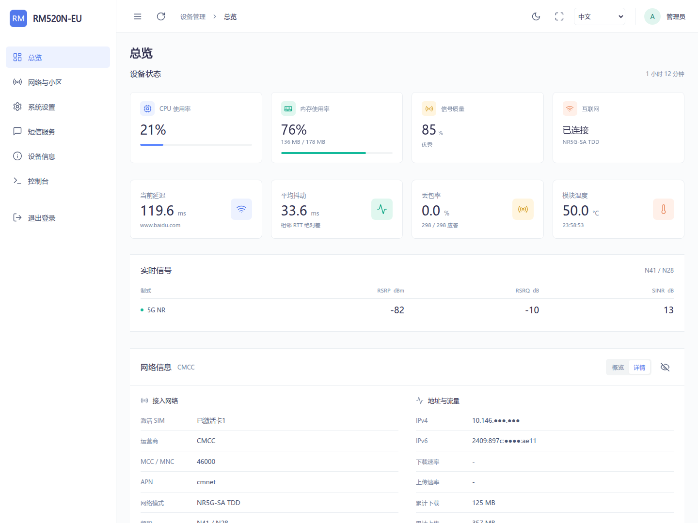
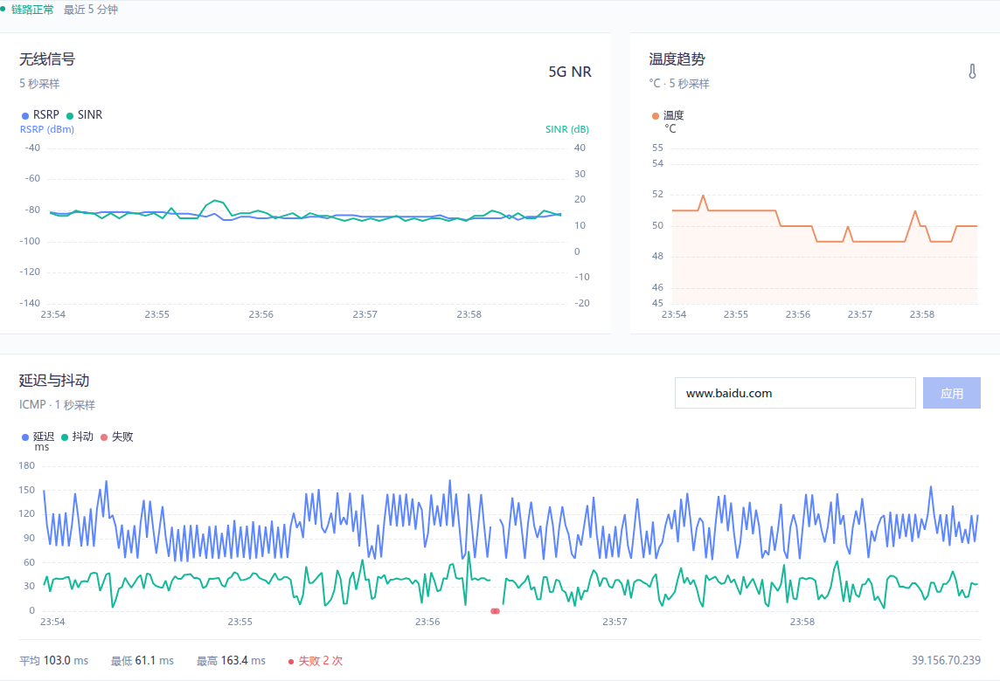
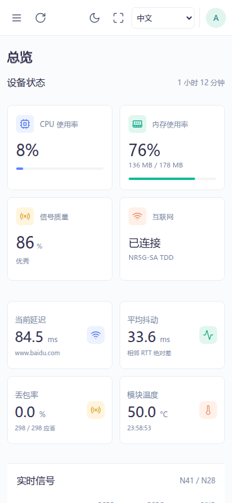

# SimpleAdmin Go

Quectel 模块的本地管理后台。通过 ADB 安装，提供设备状态、网络设置、实时曲线、短信和系统控制台。

**中文 · English · Русский · العربية**

**本地静态资源 · 五分钟内存监控 · 桌面与手机适配**

[快速安装](#快速安装) · [界面预览](#界面预览) · [实时监控](#实时监控) · [账户与语言](#账户与语言) · [常见问题](#常见问题) · [开发与构建](#开发与构建)

## 界面预览

首页上方集中展示设备状态、延迟、平均抖动、丢包率、温度和主要网络信息，下方是三张趋势图。没有有效 4G 数据时，隐藏 4G 读数与切换项。



RSRP 与 SINR 同图显示，分别使用左右两侧比例尺；温度、延迟与抖动另行展示。



| 四语言登录页 | 手机首页 |
|:---:|:---:|
|  |  |

界面按 [Art Design Pro](https://github.com/Daymychen/art-design-pro) 的布局和配色轻量适配，保留现有 Vue 页面与设备接口。图表和图标随安装包提供，不依赖外部 CDN。

## 快速安装

### 准备

- Windows 电脑、USB 数据线、已开启 ADB 的 Quectel 模块。
- 安装包中的 `toolkit.bat`、`adb.exe`、两份 ADB DLL 和 `development/` 必须放在同一目录。
- 包内已提供 ARMv7 程序，安装时不需要 Go、Node.js、WSL 或在线下载依赖。
- 已验证设备：**RM520N-EU / ARMv7 / Linux 5.4.210**。其他型号取决于固件提供的 AT 接口、系统命令及安装路径。

### 五步安装

1. 完整解压安装包，不要直接在压缩软件的预览窗口里运行。
2. 连接模块，确认 ADB 可以识别；同一时间连接一台待安装模块。
3. 双击 `toolkit.bat`，等待上传、安装和服务检查完成。
4. 如果安装修改了 mobileap / bridge0 MAC 配置，脚本会自动重启模块，等待设备重新连接。
5. 打开 **http://192.168.225.1/** 或设备实际的局域网 IP，先选择语言，再登录。

| 登录位置 | 默认用户名 | 默认密码 |
|---|---|---|
| Web 后台 | `admin` | `admin` |
| 系统控制台 | `root` | `admin`（首次初始化） |

本 Go 版本重复安装时会停止旧进程、替换应用文件，并保留有效 Web 凭据和 root 初始化标记。若原来安装的是其他 WebUI，请先用其对应的卸载工具清理冲突。

卸载本项目时运行 `uninstall.bat`。卸载会删除本应用及其配置，请先记录需要保留的设置；它不负责卸载其他项目。

### 通过 USB 访问

在安装包目录打开终端：

```powershell
.\adb.exe devices
.\adb.exe forward tcp:18081 tcp:80
```

然后打开 **http://127.0.0.1:18081/**。设备重新连接后，需要重新建立转发。

## 功能

| 页面 | 内容 |
|---|---|
| 总览 | CPU、内存、信号质量、联网状态、延迟、抖动、丢包率、温度及实时曲线 |
| 网络与小区 | 网络制式、频段锁定、小区扫描与锁定 |
| 系统设置 | Web / root 改密、USB 协议、IP 透传、DMZ、LAN IP、TTL、IMEI 与重启 |
| 短信 | 收件箱、发送短信、删除短信 |
| 设备信息 | 型号、固件、SIM 与网络信息 |
| 控制台 | 使用真实系统账号密码的终端 |

顶栏支持明暗主题、刷新、全屏和语言切换；侧栏支持桌面折叠和手机抽屉菜单。首页提供概览 / 详情及敏感信息遮罩。

## 实时监控

| 数据 | 采样间隔 | 内存保留范围 |
|---|---|---|
| RSRP、SINR、模块温度 | 5 秒 | 最近 5 分钟，共用 60 个时间点 |
| Ping RTT、Jitter | 1 秒 | 最近 5 分钟，最多 300 个时间点 |

- **信号图：** RSRP 左轴为 dBm，SINR 右轴为 dB；两个图例，支持选择有数据的 5G NR / 4G LTE。
- **Ping 目标：** 默认 `www.baidu.com`，可修改为域名或 IP，不接受协议、端口或路径。
- **平均抖动：** 对相邻成功应答计算 `|RTT[n] - RTT[n-1]|`，再取五分钟内有效差值的平均。失败或过长间隔处断开，不跨缺口计算。
- **丢包率：** 以实际发出的 ICMP 包为分母；DNS 失败、权限不足等状态单独报告。
- **后台采样：** 网页关闭后仍继续；断网时持续重试，恢复连通后继续产生延迟数据。
- **内存历史：** 不写数据库、日志或缓存文件；进程重启后清空，修改目标只清空 Ping 历史。

历史数组采用紧凑数值存储，300 个 Ping 点与 60 个信号 / 温度点共 **6240 字节，约 6.1 KiB**。这仅指历史数组，HTTP、JSON、连接及 Go 进程另有内存开销。

## 账户与语言

首次访问按浏览器语言显示，不支持的语言回退中文。登录前可选择 **中文、英语、俄语、阿拉伯语**，登录后继续沿用，也可在顶栏或系统设置切换。

语言偏好仅保存在当前浏览器，不写入设备 NAND；清除站点数据后重新按浏览器语言选择。阿拉伯语使用从右到左布局，信号数值、IP、图表坐标及控制台原始输出保持正常阅读顺序。

在“系统设置”顶部可以分别修改 Web 密码与系统 root 密码，需填写当前密码、新密码和确认密码。保存成功后，旧会话及控制台连接失效，需要重新登录。

系统 root 密码首次安装初始化为 `admin`，后续升级保留已修改密码；它与 Web 密码独立。root 改密依赖设备的 OpenSSL 与系统 `passwd`。应用目录和主程序按设备部署要求使用 `777`，Web 凭据使用 `600`，不会递归把密码文件设为 `777`。

## 持久化与 NAND 写入

设备配置统一按以下顺序保存：

```text
根目录 remount rw
    → 写入临时文件并同步
    → 原子替换目标文件并同步目录
    → 根目录 remount ro
```

写入或恢复只读失败会返回错误，异常路径仍尝试恢复只读。同样内容不重复写入；保存操作串行执行，跨进程锁放在确认的 tmpfs 中。

监控历史和会话仅保存在内存；默认不持续落盘应用日志，也不定时执行全局同步。PID 仅放在 tmpfs。操作系统及模块固件自身的闪存写入不由本程序控制。

## 安装行为

安装路径为 `/usrdata/simpleadmin`，优先使用 `simpleadmin-httpd.service` 自启；systemd 不可用时使用后台脚本和带标记的 post_boot 自启块。

为释放 80 端口，安装会停止旧 SimpleAdmin 和原厂指定的 lighttpd 运行实例，不删除原厂 Web 目录与配置。AT 默认直接访问 `/dev/smd11`，清理旧 SimpleAdmin 串口桥接残留，不操作系统 `port_bridge`。

bridge0 MAC 辅助脚本按设备配置处理 `mobileap_cfg.xml`，首次修改前保存同目录 `.simpleadmin.bak`。只有实际修改或恢复配置才要求重启。

## 常见问题

| 现象 | 检查方法 |
|---|---|
| 一直等待设备 | 运行 `adb.exe devices`，检查数据线、驱动及 ADB 状态 |
| 页面打不开 | 使用 `http://`；确认实际 IP，或通过 ADB 转发访问 |
| 显示旧界面 | 强制刷新或清理站点缓存，确认访问的是本程序 |
| 没有 4G 数据 | 只读到 5G 时主动隐藏 4G，属于正常行为 |
| Ping 显示 DNS 失败 | 检查模块 DNS、默认路由和数据连接，或使用可达 IP 验证 |
| 图表出现断点 | 查询失败或设备忙时保留缺测，不填零 |
| 保存设置失败 | 检查 rw / ro 挂载结果、空间及 tmpfs，不要忽略报错反复写入 |
| 控制台密码错误 | 使用系统 root 密码，不能用独立修改过的 Web 密码代替 |

查看设备服务与根挂载：

```powershell
.\adb.exe shell systemctl status simpleadmin-httpd.service
.\adb.exe shell head -n 1 /proc/mounts
```

ADB 开启方法和 RGMII 指令与型号、固件及 USB 配置相关，请按对应设备资料操作，不要套用其他模块的 VID / PID。

## 开发与构建

| 路径 | 用途 |
|---|---|
| `toolkit.bat` / `uninstall.bat` | Windows ADB 安装 / 卸载入口 |
| `development/` | 安装脚本、ARMv7 程序、静态资源、服务文件 |
| `go-build/simpleadmin-go/` | Go 后端源码与测试 |
| `web-assets/` | ECharts / Lucide 构建源与依赖锁文件 |
| `tests/` | 前端逻辑回归测试 |
| `windows-test/` | Windows 模拟测试程序及脚本 |
| `docs/images/` | 界面截图 |

### 本地预览

Windows 双击 `run_windows_test.bat`，打开 **http://127.0.0.1:18080/**，默认账号为 `admin / admin`。模拟模式不操作真实 AT 接口、TTL、挂载或系统密码，详细方法见 [Windows 测试说明](windows-test/README.md)。

### 编译与测试

发布程序使用 **Go 1.26.3**，普通安装无需重新编译。

```sh
cd go-build/simpleadmin-go
go test ./...
go vet ./...
CGO_ENABLED=0 GOOS=linux GOARCH=arm GOARM=7 go build -buildvcs=false -trimpath -ldflags '-s -w' -o ../../development/simpleadmin/simpleadmin-httpd.armv7 ./cmd/simpleadmin-httpd
```

在仓库根目录执行前端测试：

```sh
node --test tests/*.test.cjs
```

只在修改图表或图标依赖后构建资源：

```sh
cd web-assets
npm ci
npm run build
```

WSL 项目放在 `~/projects/` 等 Linux 原生目录，`/mnt/...` 仅用于与 Windows 传输文件。

### 主要实现

- `js/locales.js`：登录页和后台共用的四语言资源、浏览器偏好与页面方向。
- `js/simpleadmin-core.js`：API、认证、品牌与公共界面能力；`js/pages/` 保存页面逻辑。
- `js/monitor.js`：内存快照展示、双轴图表与目标设置。
- `telemetry*.go`：后台采样、ICMP、五分钟历史和统计。
- `persistence*.go`：配置串行写入、同步及挂载恢复。
- `root_password*.go` / `session_lifecycle.go`：系统改密与会话撤销。
- `at_cache.go` / `native_console.go`：有界 AT 队列、缓存和系统终端。

监控接口为 `GET /api/telemetry` 和 `POST /api/telemetry/target`，均要求有效会话。WebSocket 每条业务消息重新验证会话，退出或改密会关闭关联连接。

## 第三方项目

使用 Art Design Pro 布局与配色适配、Vue 3、Bootstrap、Apache ECharts、Lucide 和 pro-bing。随包许可位于 [www/licenses](development/simpleadmin/www/licenses/)，依赖版本由锁文件与 Go 模块文件管理。

## 1. 后续代码修改方法

后续修改代码时，必须把改动限制在当前目标需要的最小范围内，并遵守以下四个原则。

| 原则 | 用来避免的问题 |
|---|---|
| 编码前思考 | 错误假设、隐藏困惑、缺少权衡 |
| 简洁优先 | 过度复杂、臃肿抽象 |
| 精准修改 | 无关编辑、触碰不该碰的代码 |
| 目标驱动执行 | 只追求“改了”，没有可验证成功标准 |

### 1.1 编码前思考

- 不确定时先说明不确定点，不要默默猜测。
- 存在多种解释时，先列出解释和取舍。
- 发现更简单、更稳、更少改动的方法时，先说明。
- 困惑时停下来，不带着错误假设继续扩大修改。

### 1.2 简洁优先

- 不添加需求之外的功能。
- 不为一次性逻辑新增抽象层。
- 不添加未要求的灵活性、配置项或扩展机制。
- 不为几乎不会发生的场景增加额外分支。
- 能用更少、更直观代码表达时，优先简化。

### 1.3 精准修改

- 只改和当前请求直接相关的文件、函数和逻辑。
- 不顺手重构相邻代码、注释或格式。
- 匹配现有代码风格。
- 发现无关死代码时只说明，不主动删除。
- 本次改动产生的孤儿变量、函数或声明，应随本次改动一起清理。

### 1.4 目标驱动执行

每次修改前先定义目标和验证方式。多步骤任务使用下面格式：

```text
1. [步骤] -> 验证: [检查]
2. [步骤] -> 验证: [检查]
3. [步骤] -> 验证: [检查]
```

每次修改完成后至少说明：

```text
目标：本次要解决的问题
改动：实际修改的文件和逻辑
验证：已做检查；无法完整编译或实测时明确说明
```

### 1.5 README 维护规则

- README.md 不写任何形式的版本修改记录、更新记录、变更记录或本次改动记录。
- README.md 只描述当前文件、函数、功能、方法和运行流程。
- “后续代码修改方法”这一节必须始终放在 README.md 最后。
- 后续代码修改方法不能删减；只能按明确要求补充规则。
